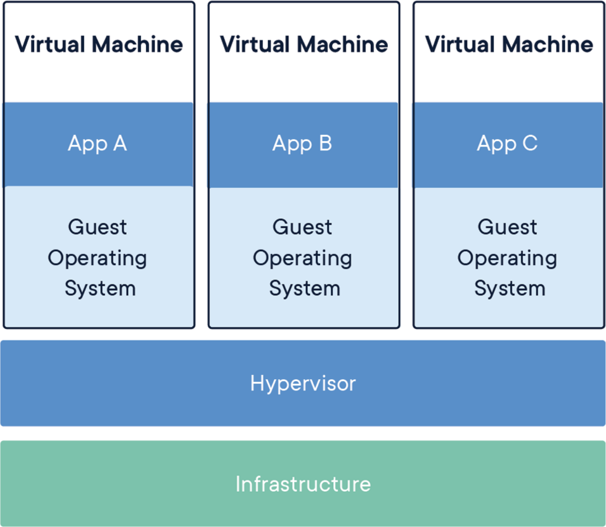
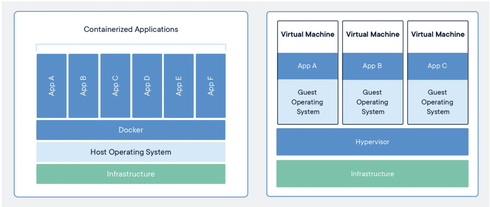
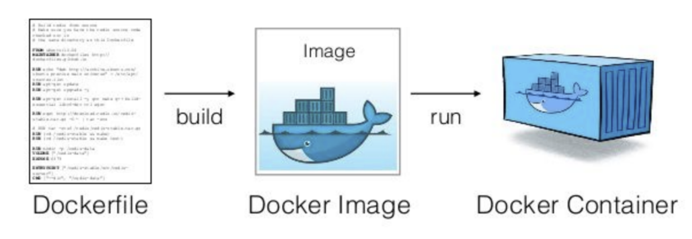

# ☁️ 클라우드 ( Cloud )  

클라우드 서비스는 **인터넷을 통해 제공되는 인프라, 플랫폼, 또는 소프트웨어**를 말함  
다른 회사의 공급자가 호스팅하여 사용자는 자체 인프라나 하드웨어 설치 없이 서비스를 이용할 수 있

---

## 1. 배포 방식의 변화

### 1.1. 전통적 배포방식
- 하나의 물리적 컴퓨터에 하나의 OS 설치
- 여러명의 사용자가 계정을 나눠 사용 가능
- 여러 프로그램 설치 가능, 하지만 상호 영향 존재

### 1.2. 가상화 배포방식
- **가상머신(VM)**: 하드웨어를 소프트웨어적으로 구현
- 계정을 나눈 것이 아니라 여러 개의 OS 구동
- CPU, RAM을 물리적으로 갈아끼는 것이 아니라 설정만으로 더 나은 자원 분리와 관리 제공  

> Hypervisor : 하나의 시스템 상에서 가상 컴퓨터를 여러 개 구동할 수 있도록 해 주는 중간 계층을 의미하며 이 위에 여러개의 가상머신을 구축할 수 있고 가상머신 위에 OS와 그 위에 앱이 올라가는 형태로 가상머신을 독립적으로 수행할 수 있음

### 1.3.오프프레미스 vs 온프레미스
- **오프프레미스 (off-premise)**: 클라우드 서비스를 통해 인프라 관리 부담 감소
  - 전력, 위치, 서버 세팅, 확장성을 고민하지 않고 서비스 운영에만 집중이 가능
- **온프레미스 (on-premise)**: 자체 시설에서 직접 인프라를 관리
  - 직접 유지 관리하는 프라이빗 데이터 센터(IDC)
  - ex) 네이버 데이터 센터

---

## 2. 클라우드 서비스 모델

- ### IaaS (Infrastructure-as-a-Service)
  - 가장 기본적인 클라우드 서비스 모델
  - 사용자는 제공된 인프라 위에 원하는 소프트웨어를 자유롭게 설치, 관리
  - 플랫폼에 종속 되지않아 유연성/이식성이 높지만 운영비 효율이 낮음
  - **예시**: AWS EC2, Google Compute Engine

- ### PaaS (Platform-as-a-Service)
  - 인프라와 함께 플랫폼 제공
  - 사용자는 애플리케이션 개발에 집중, 나머지 관리는 클라우드가 수행
  - 플램폿에 종속되지 않아 유연성/이식성이 낮고 운영이 효율이 좋다
  - 모니터링, CI/CD가 제공 됨
  - **예시**: Heroku, Google App Engine
> **CI/CD (Continuous Integration/Delivery & Deployment)**
> - 코드 변경 사항을 지속적으로 합치고 자동으로 배포하는 프로세스
> - 개발 생산성 및 배포의 신뢰성 향상

- ### SaaS (Software as a Service)
  - 완전한 소프트웨어 솔루션을 클라우드 서비스로 제공
  - 사용자는 서비스를 바로 사용할 수 있음
  - **예시**: Google Docs, Microsoft 365

---

## 3. 컨테이너와 도커

### 3.1. 컨테이너
- **코드와 종속성을 함께 패키징**하여 다양한 컴퓨팅 환경에서 빠르고 안정적이게 실행 가능
- OS를 공유하여 경량화와 빠른 실행을 제공
- OS에 문제가 생기면 다른 앱에도 영향을 미칠 수 있음

### 3.2. 도커 (Docker)
- 컨테이너의 생성, 배포, 실행을 도와주는 플랫폼
- **도커파일**로부터 **도커이미지**를 생성, 이를 통해 **도커컨테이너** 실행
  

- 서버 환경 구성을 이미지로 관리, 빠르고 일관된 배포 가능
> 1. 도커파일 : 패키지, 환경변수설정 등을 기록한 파일. 이를 빌드해 도커이미지로 변환
> 2. 도커이미지 : 컨테이너 실행에 필요한 파일과 설정값, 데이터 등을 포함된 상태값이며 불변. 
> 하나의 이미지에서 여러개의 컨테이너를 생성할 수 있으며 컨테이너의 상태와는 무관하게 이미지는 그대로 존재. 예를 통해 1대의 서버에 환경설정해야 한다면 미리 만들어 놓은 이미지를 다운받아서 이를 통해 컨테이너만 만들면 끝
> 3. 도커컨테이너 : 컨테이너가 실행시키면 도커이미지에 설정된 프로그램, 데이터 등이 실제 컴퓨팅자원과 연결

### 도커의 활용
- 대규모로 운영되는 서비스에서 컨테이너를 통한 배포가 일반화
- 구글은 매주 약 20억 개의 컨테이너를 도커를 통해 관리 (2014년도)

---