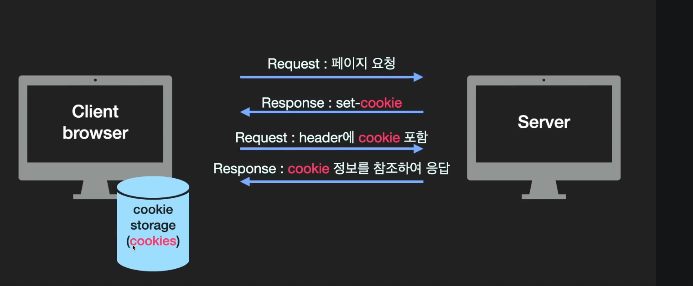
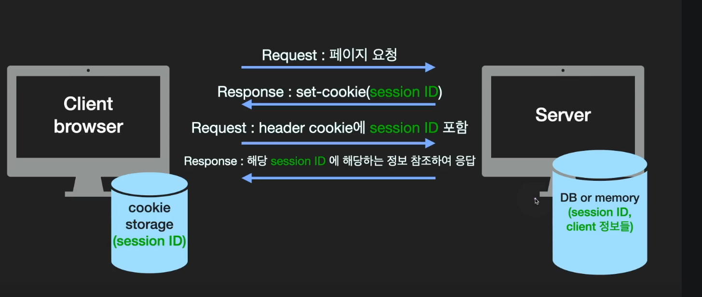
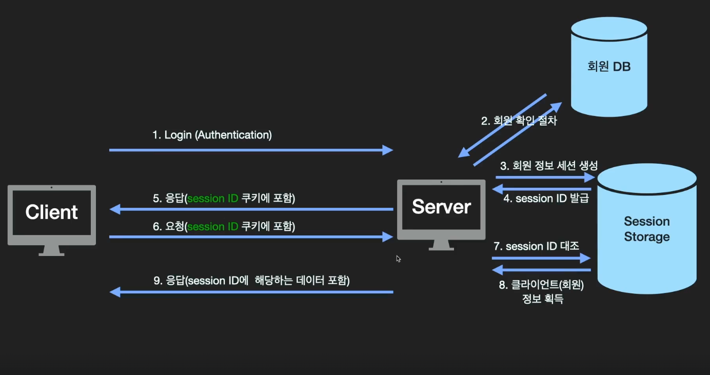

# Cookie & Session 예상질문

## 사용하는 이유

- 기본적으로 HTTP 통신은 `Connectless`, `Stateless`이다. 즉, 서버와 클라이언트는 계속해서 연결할 수 없기때문에 서버로 부터 받은 정보를 브라우저(Local)에서 추가적으로 저장할 필요가 있다.

## 🍪 Cookie

### 생성과정

1. 서버가 클라이언트로부터 요청을 받으면 서버측에서 쿠키를 생성한다. (ex. 로그인시 유저정보)
2. 응답(Response) Header에 쿠키를 담아서 보낸다.
3. 브라우저는 서버로부터 받은 쿠키를 브라우저 쿠키 디렉토리에 저장한다.
4. 쿠키는 `key -value`로 구성된 데이터 파일이다.
5. 쿠키의 유효시간이 존재하며 브라우저가 자동으로 쿠키를 Header담아서 추가 요청을 보낸다.
6. 서버는 cookie 정보를 참조해서 그에 맞는 정보들을 내보낸다.

## Session

### 생성과정

1. 쿠키를 이용하는 구현방식은 동일하다.
2. 서버가 클라이언트로부터 요청을 받으면 서버측에서 클라이언트를 구분하는 `Session Id`를 생성한다.
3. 응답(Response) Header에 Session Id정보를 담아서 보낸다.
4. 브라우저는 서버로부터 받은 정보를 쿠키 디렉토리에 저장한다.
5. 추가적인 요청부터는 Header에 쿠키(session ID)를 포함하여 보낸다.
6. 서버는 Session Id에 해당하는 정보를 내보낸다.

## 쿠키와 세션의 차이점

- 세션이 보안이 더 우수하다

  - 쿠키방식은 브라우저 쿠키디렉토리에 민감한 정보 (ex. 사용자 정보)들이 그대로 노출되기 때문이다.
  - 반면, 세션은 session id만 노출이 되고 서버에서 정보관리가 된다.
  - 브라우저를 닫으면 세션은 유지가 되지 않는다.

- 세션 방식은 서버에 부담을 줄 수 있다.
  - 서버의 자원을 이용하기 때문에 웹 페이지의 속도저하를 가져다 줄 수 있다.

## 쿠키의 사용예시

- 자동로그인, 아이디 기억하기
- 쇼핑몰 카트담기
- 팝업(오늘 더이상 보지 않기)

## 쿠키와 세션을 이용한 로그인 방식설명

