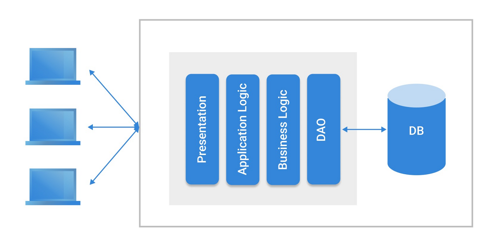
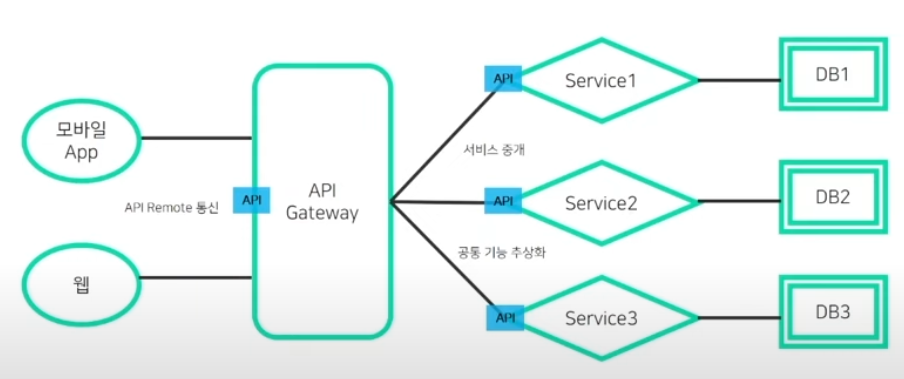

# Monolithic & MSA(MicroService Architecture)

### 모놀리식 아키텍쳐 (Monolithic Architecture)

**각 서비스들이 강하게 결합되어 하나의 전체 시스템으로 통합되어 있는 구조**

특징 :
- 단일 코드베이스 : 전체 어플리케이션은 하나의 코드베이스에서 관리
- 간단한 개발 및 배포 : 초기 개발과 배포가 상대적으로 간단
- 단일 언어 및 프레임 워크 사용 : 보통 하나의 프로그래밍 언어와 프레임워크로 구성
- 수직적 확장(스케일업) : 서능 향상을 위해 하드웨어를 업그레이드하는 방식을 취함

장점 :
- 개발 초기 용이성 : 초기 개발과 테스트가 비교적 간단
- 간소화된 디버깅 및 테스트 : 모든 구성 요소가 한 곳에 있어 디버깅과 테스트가 용이

단점 :
- 유연성 부족 : 새로운 기술이나 언어로의 이전이 어려움
- 확장성 제한 : 큰 트래픽에 대응하기 어렵고, 수직적 확장에 한계가 있음
- 배포 복잡성 : 작은 변경사항도 전체 애플리 케이션을 재배포해야 함

---

### MSA (MicroService Architecture)

**서비스를 비지니스 경계에 맞게 세분화 하고, 서비스 간 통신은 네트워크 호출을 통해 진행하여, 확장 가능하고 회복적이며 유연한 어플리케이션을 구성하는 것**

특징 : 
- 분산된 서비스 : 각 서비스는 독립적으로 개발, 배포, 운영됨
- 언어 및 기술의 다양성 : 서비스마다 다른 프로그래밍 언어와 기술 스택을 사용할 수 있음
- 수평적 확장(스케일아웃) : 서비스를 여러 서버에 분산시켜 확장

장점 :
- 유연성 및 확장성 : 개별 서비스를 독립적으로 확장 및 개선할 수 있음
- 기술적 다양성 : 다양한 기술과 언어의 조합이 가능
- 장애 격리 : 하나의 서비스에 문제가 생격도 전체 시스템에 영향을 미치지 않음

단점 :
- 복잡한 관리 및 운영 : 서비스가 많아질수록 관리가 복잡해짐
- 네트워크 지연 : 서비스 간 통신이 네트워크를 통해 이루어지기 떄문에 지연이 발생할 수 있음
- 데이터 일관성 유지 : 분산된 서비스에서 데이터 일관성을 유지하는 것이 어려울 수 있음
- 서비스 간의 복잡한 통신 : 서비스가 서로 의존하게 되면 통신이 복잡해질 수 있으며, 이는 시스템의 전체적인 복잡도를 증가시킴

---

### Monolithic vs MSA
- **개발 및 유지 관리** : 모놀리식은 초기 개발과 유지 관리가 비교적 간단하지만, 시스템이 커지면 복잡해짐. 반면, MSA는 초기에 구축 및 관리가 복잡하지만, 장기적으로 더 유연하고 확장 가능

- **확장성** : 모놀리식은 주로 수직적 확장(스케일 업)에 의존하지만, 이는 비용과 성능의 한계를 가질 수 있음. MSA는 수평적 확장(스케일 아웃)을 통해 트래픽 증가에 더 잘 대응할 수 있음

- **부하 분산** : MSA는 각 서비스가 독립적으로 부하를 관리할 수 있어, 특정 서비스에 문제가 발생해도 전체 시스템에 영향을 미치지 않음 모놀리식 구조에서는 한 부분의 문제가 전체 시스템에 영향을 줄 수 있음

- **기술 스택** : MSA는 다양한 기술, 언어, 데이터베이스 시스템을 혼합하여 사용할 수 있어 기술적 유연성을 제공. 반면, 모놀리식은 일반적으로 단일 기술 스택에 제한

 

### 선택 기준
- **프로젝트 규모와 복잡성** : 작고 단순한 프로젝트의 경우 모놀리식이 더 적합할 수 있음. 반면, 대규모 및 복잡한 시스템은 MSA로 이점을 얻을 수 있음
- **팀 구조** : 분산된 팀이나 여러 팀이 협업하는 경우, MSA가 각 팀이 독립적으로 작업할 수 있는 유연성을 제공
- **비지니스 요구사항** : 빠른 시장 출시와 빈번한 업데이트가 필요한 경우 MSA가 더 적합할 수 있음

---

> 출처 :
> 	https://www.youtube.com/watch?v=8d4h7K_Fq-0  
>	https://www.youtube.com/watch?v=ZRpsB3ODr6M	

> < 그림 1 : https://velog.io/@dldydrhkd/모놀리식-아키텍처 >  
> < 그림 2 : YouTube - Naver Cloud Platform : [Talk&Talk] 누구나 쉽게 이해할수 있는 마이크로서비스 아키텍처(MSA)>  
> < 그림 3 : YouTube - 코딩애플 : 마이크로서비스가 뭔데 유행임 >