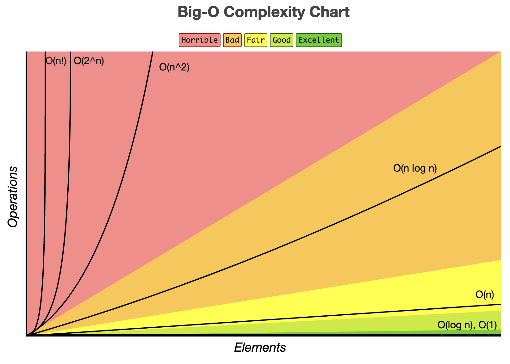

# 시간복잡도 (Time Complexity)
코드의 실행 시간이 어떤 요인으로 결정되는지 나타내는 시간과 입력 데이터의 함수 관계

## 빅오 표기법
빅오(Big-O) 표기법은 알고리즘이 겪을 수 있는 최악의 경우에 걸리는 시간과 입력 간의 상관관계를 표현합니다.
입력 크기가 N이고, 이에 비례하는 시간이 걸린다면 O(N)으로 표기합니다.

### O(N) 예시
```java
public int search(int[] array, int target) {
    int count = 0;
    for(int answer : array) {
        if (answer == target) return count;
        count ++;
    }
    return -1;
}
```
위 코드는 때로는 배열의 첫번째에서, 때로는 중간에서 원소를 찾을 것 입니다.
하지만 최악의 경우에는 모든 원소를 순회 할 수도 있습니다.
즉, 전체 배열을 순회하므로 O(N) 시간 복잡도를 갖게 됩니다.

## 시간복잡도 그래프


###### 출처 : https://www.bigocheatsheet.com/

### 알고리즘과 시간복잡도

| 알고리즘 | 시간복잡도 |
| :---: | :---: |
| 이진탐색 | O(logN) |
| 선형탐색 | O(N) |
| 정렬 | O(N logN) |
| 조합 | O(2ⁿ) |
| 순열 | O(N!) |


### 시간 복잡도 별 N크기에 따른 계산 결과

|        | 1 | 2  | 3  | 4  | 8  | 16 | 32 | 64 | 1000 |
|--------|---|----|----|----|----|----|----|----|------|
| O(1)      | 1 | 1  | 1  | 1  | 1  | 1  | 1  | 1  | 1    |
| O(logN)  | 0 | 1  | 1.58| 2  | 3  | 4  | 5  | 6  | 9.97 |
| O(N)      | 1 | 2  | 3  | 4  | 8  | 16 | 32 | 64 | 1000 |
| O(N logN) | 0 | 2  | 4.75| 8  | 24 | 64 | 160| 384| 9966 |
| O(N²)     | 1 | 4  | 9  | 16 | 64 | 256| 1024| 4096| 1000000|
| O(N³)     | 1 | 8  | 27 | 64 | 512| 4096| 32768| 262144| 1000000000|
| O(2ⁿ)     | 2 | 4  | 8  | 16 | 256| 65536| 4294967296| 약 1.844 x 10¹⁹| 약 1.07 x 10³⁰¹|
| O(N!)     | 1 | 2  | 6  | 24 | 40320| 20922789888000| 약 2.63 x 10³⁵| 약 1.27 x 10⁸⁹| 약 4.02 x 10²⁵⁶⁷|

위 표에서 보이는 것과 같이 N이 커질수록 시간복잡도의 결괏값 차이가 커집니다.
규모가 큰 서비스일수록 효율적인 코드가 중요한 이유입니다.

## 시간복잡도 계산하기

- 반복횟수 세어보기
    - 시간복잡도는 정확한 실행 시간을 계산하는 용도가 아님
    - 실행시간이 어떤 요인으로 결정되는지 나타내는 수식

- 예제
    1. 길이가 N인 배열의 반만 사용하는 알고리즘의 시간복잡도 : O(N/2) (X)
    2. 길이가 N인 배열을 두번 반복 : O(2N) (X)
        - N과 비례하다는 것을 알리는 것이 목적이기 때문에 O(N)으로 표시 (상수 제거)
    3. 길이가 N인 배열을 M번 반복 : O(N) (X)
        - M이 문제의 조건에 따라 달라진다면 M을 무시하면 안됨 O(MN)으로 표시
    4. N열짜리 배열 순회 후 M열짜리 배열 순회 : O(N+M)

## 시간 복잡도를 줄이는 방법

비효율적인 시간 복잡도 : 시간 복잡도 수식에 가장 큰 입력을 대입하여 계산한 결과가 1억 이상

- 예제
    1. 1억개의 배열에서 특정 원소의 위치를 찾을때
        - for문으로 순회한다면 O(N)으로 문제가 생길 수 있음.
        - 이진 탐색을 사용하면 O(logN)으로 훨씬 효율적
    2. 배열에서 중복된 원소들을 찾고 싶을때
        - 배열 전체 순회 : O(N²)
        - Set 사용 : O(N)

| N | 유추 가능한 시간 복잡도 | 유추 가능한 알고리즘 |
|:---:|:---:|:---:|
| 10 | O(N!) | 순열 |
| 20 | O(2ⁿ) | 조합 |
| 1,000 ~ | O(N³), O(N³logN) | 완전 탐색, 이진 탐색 |
| 10,000 ~ | O(N logN) | 정렬, 이진 탐색 |

### 여러 알고리즘을 사용할 때 시간 복잡도

- 예제
    - 길이가 N인 배열을 이중 반복문으로 순회 = O(N²)입니다.
    - 별개로 다시 한 번 추가적으로 순회한다면 O(N² + N)이 됩니다.
    - 하지만 빅오 표기법에서는 실행시간에 가장 큰 영향을 미치는 항만 표기합니다.
        - 정답 : O(N²)