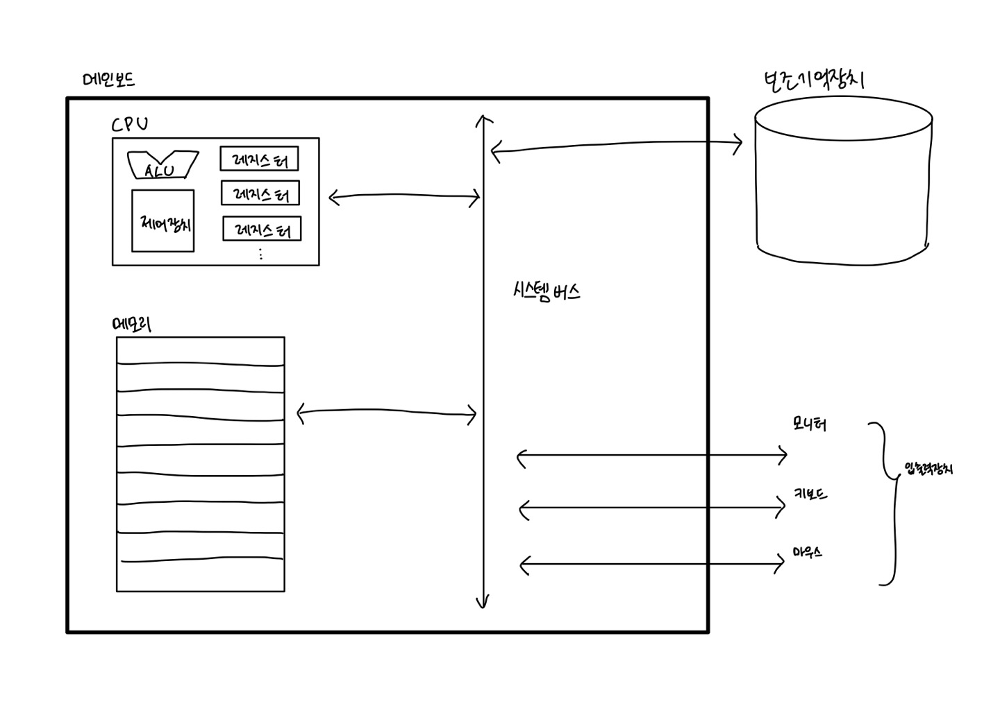

# CS 지식이 필요한 이유 
컴퓨터 구조를 이해하면 입력과 출력에만 집중하는 개발을 넘어 성능, 용량, 비용까지 고려하며 개발하는 개발자가 될 수 있다.

# Computer Science

## 컴퓨터가 이해하는 정보

### 데이터
컴퓨터가 이해하는 숫자, 문자, 이미지, 동영상과 같은 **정적인 정보**
- 컴퓨터와 주고받는 정보나 컴퓨터에 저장된 정보

### 명령어
데이터를 움직이고 컴퓨터를 작동시키는 정보

예) '1'과 '2'는 데이터이고, "'1'과 '2'를 더하라"는 명령어이다.

## 핵심 부품 4가지
1. CPU : 중앙처리장치
2. 메모리 : 주기억장치
    - **RAM**, ROM
3. 보조기억장치
4. 입출력장치

### 메모리
프로그램이 실행되기 위해서는 명령어와 데이터가 저장되어 있어야 하며, 메모리에서 **현재 실행되는** 프로그램의 명렁어와 데이터를 저장한다.

- 메모리에 저장된 값의 위치는 **주소**를 통해 알 수 있다.
    - 저장된 값에 빠르고 효율적으로 접근 가능하다.

### CPU
메모리에 저장된 명렁어를 읽고, 읽은 명령어를 해석하고, 실행하는 부품이다.

`<CPU 내부 구성 요소>`

1. ALU(산술논리연산장치)

    - 컴퓨터 내부에서 수행되는 계산을 수행
2. Register(레지스터)

    - CPU 내부에서 프로그램을 실행하는 데 필요한 값들을 임시로 저장하는 작은 저장 장치
3. CU(제어장치)

    -컴퓨터 부품들을 관리하고 작동시키기 위한 전기 신호를 내보내고 명령어를 해석하는 장치

### 보조기억장치
**보관할 프로그램**을 저장한다.

`<보조기억장치가 필요한 이유>`

1. 메모리는 가격이 비싸 저장 용량이 적다.
2. 전원이 꺼지면 저장된 내용을 잃는다.
-> 전원이 꺼져도 보관될 프로그램을 저장하는 부품

- 보조기억장치 종류
    
    - 하드디스크, SSD, USB 메모리, DVD, CD-ROM

### 입출력장치

### 메인보드와 시스템버스
