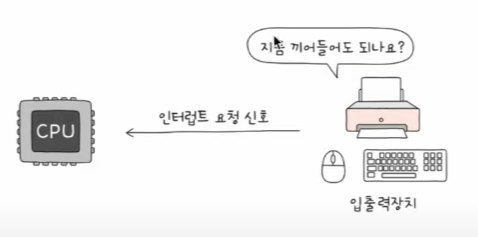
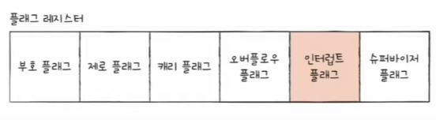
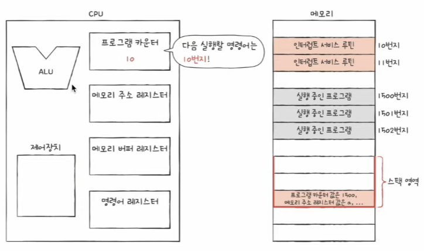
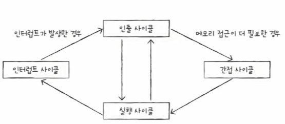

# 명령어 사이클과 인터럽트
CPU가 **하나의 명령어를 처리하는 과정에서 정해진 흐름**이 있고, 그 흐름을 반복하며 명령어를 처리해 나간다.
간혹 이 흐름이 끊어지는 상황을 인터럽트라고 한다.

## 명령어 사이클
- 프로그램은 수많은 명령어로 이루어져 있고, CPU는 명령어들을 하나씩 실행한다. 
- 프로그램 속 각각의 명령어들은 일정한 주기가 반복되며 실행된다.

   `<메모리에 저장된 명령어 하나를 실행하는 경우>` 

       1. 인출 사이클(fetch cycle) : 메모리에 있는 명령어를 CPU로 가져온다.
       2. 실행 사이클(execution cycle) : CPU로 가져오는 명령어를 실행한다.
            - 제어장치가 명령어 레지스터에 담긴 값을 해석
            - 제어 신호를 발생

    `<간접 주소 지정 방식의 경우>`
        
        3. 간접 사이클(indirect cycle) : 메모리 접근이 필요한 경우

    

    
 간접 주소 지정 방식 

    

    유효 주소의 주소를 오퍼랜드 필드에 명시한다. 
    - 장점 : 직접 주소 직정 방식보다 표현할수 있는 유효 주소의 범위가 더 넓어진다.
    - 단점 : 두 번의 메모리 접근이 필요해 느리다.

    
    

    

## 인터럽트
- CPU의 정상적인 작업을 방해하는 신호

### 종류
- 동기 인터럽트(=예외) : CPU에 의해 발생하는 인터럽트
    - CPU가 실행하는 프로그래밍상의 오류와 같은 **예외**적인 상황에 마주쳤을 때 발생하는 인터럽트

- 비동기 인터럽트(=하드웨어 인터럽트) : 입출력 장치에 의해 발생하는 인터럽트
    - 알림 역할 : 세탁기 완료 알림, 전자레인지 조리 완료 알림 등
    - 입출력 작업 도중에도 효율적으로 명령어를 처리하기 위해 사용

    

    
추가 설명 

    

    입출력 장치는 CPU에 비해 느리다인터럽트가 없다면 CPU는 프린트 완료 여부를 확인하기 위해 주기적으로 확인해야 한다인터럽트가 있다면 입출력 작업 동안 CPU는 다른 일을 할 수가 있다.
    

 
---

## 하드웨어 인터럽트 처리 순서
1. 입출력 장치는 CPU에 **인터럽트 요청 신호**를 보낸다.

2. CPU는 실행 사이클이 끝나고 명령어를 인출하기 전 항상 인터럽트 여부를 확인한다.

3. CPU는 인터럽트 요청을 확인하고 **인터럽트 플래그**를 통해 현재 인터럽트를 받아들일 수 있는 지 여부를 확인한다.

추가 설명 

모든 하드웨어 인터럽트를 인터럽트 플래그로 막을 수 있는 것은 아니다.
무시할 수  있는 인터럽트는 정전이나 CPU 고장 등과 같이 예외적인 경우이다.

 

4. 인터럽트를 받아들일 수 있다면 CPU는 지금까지의 작업을 백업한다.

5. CPU는 **인터럽트 벡터**를 참조하여 **인터럽트 서비스 루틴**을 실행한다.

인터럽트 서비스 루틴 

인터럽트를 처리하기 위한 프로그램
인터럽트를 처리하는 방법은 입출력장치마다 다르기 때문에 메모리에 여러 개의 인터럽트 서비스 루틴이 저장되어 있다.

 

인터럽트 벡터 

각기 다른 인터럽트 서비스 루틴을 식별하기 위한 정보
CPU는 하드웨어 인터럽트 요청을 보낸 대상으로부터 데이터 버스를 통해 인터럽트 벡터를 전달 받는다.

6. 인터럽트 서비스 루틴 실행이 끝나면 4.에서 백업해둔 작업을 복구하여 실행을 재개한다.
<video src="images/05-3.mp4" controls title="Title"></video>

