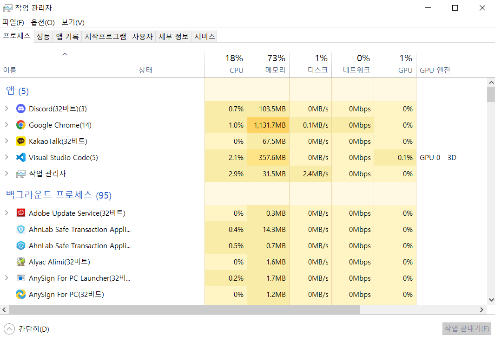
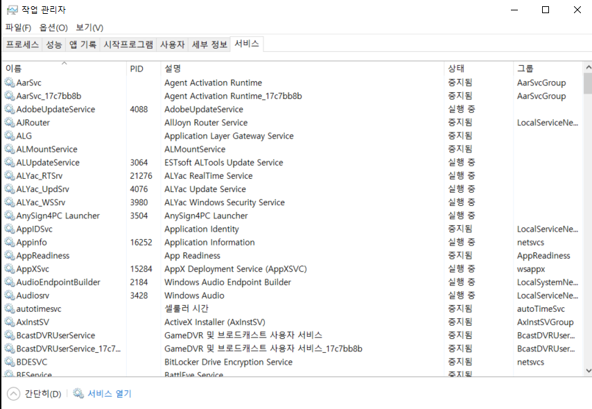
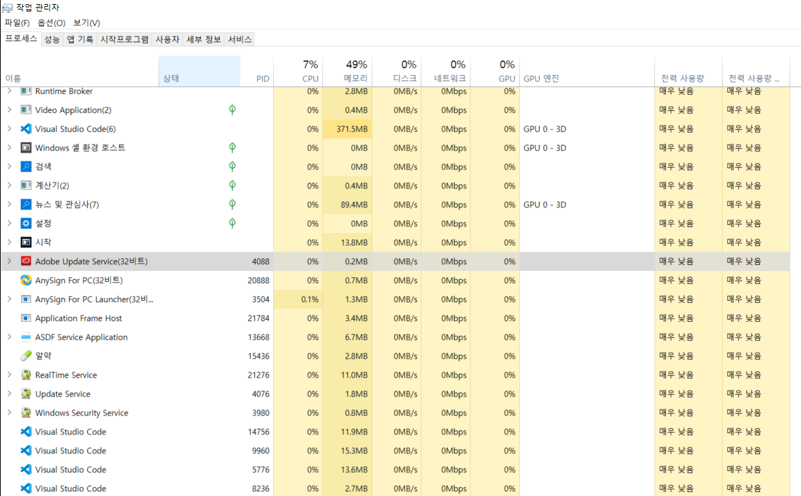
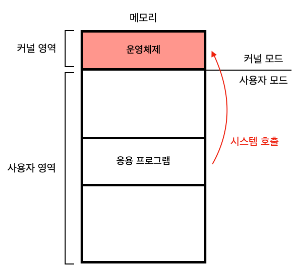
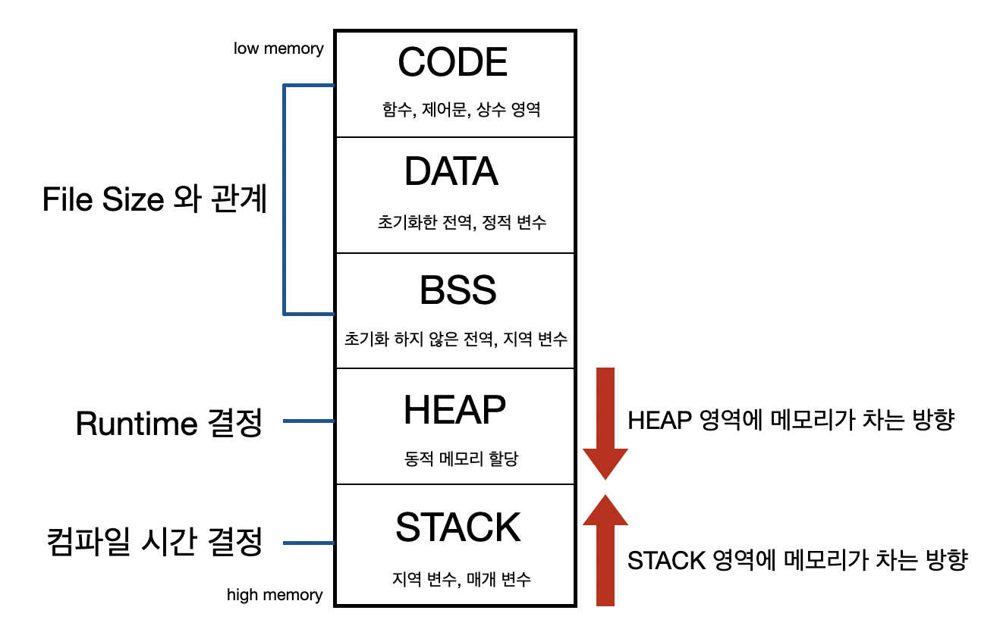
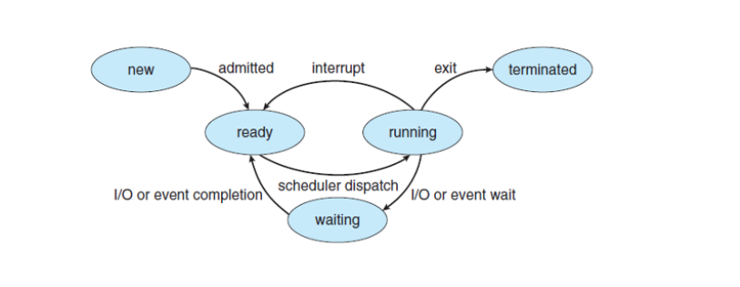

# 프로세스
- 프로그램이 실행되기 전에는 보조기억장치에 있는 데이터 덩어리
- 보조기억장치에 저장된 프로그램을 메모리에 적재하고 실행하는 순간 프로세스가 된다.

## 포그라운드 프로세스(foreground process)
사용자가 볼 수 있는 공간에서 실행되는 프로세스

## 백그라운드 프로세스(background process)
사용자가 보지 못하는 뒤에서 실행되는 프로세스

- 데몬/서비스 : 사용자와 상호작용하지 않고 그저 묵묵히 정해진 일만 수행하는 백그라운드 프로세스

----

모든 프로세스가 CPU를 동시에 사용할 수 없기 때문에 프로세스들은 차례대로 돌아가며 한정된 시간만큼만 CPU를 이용한다.
이용이 끝나면 인터럽트(타이머 인터럽트)가 발생하여 차례를 양보하고 다음 차례가 올때까지 기다린다.
운영체제는 프로세스의 실행 순서를 관리하고, CPU를 비롯한 자원을 배분한다.

*타이머 인터럽트(타임아웃 인터럽트) : 클럭 신호를 발생시키는 장치에 의해 주기적으로 발생하는 하드웨어 인터럽트

# 프로세스 제어 블록(PCB)
- 프로세스와 관련된 정보(식별하기 위해 꼭 필요한)를 저장하는 자료 구조
- 메모리의 커널 영역에 생성된다.
- 프로세스 생성 시에 만들어지고 실행이 끝나면 폐기된다.

### 프로세스 ID (PID)
- 특정 프로세스를 식별하기 위해 부여하는 고유한 번호

### 레지스터 값
- 해당 프로세스가 실행하며 사용했던 프로그램 카운터를 비롯한 레지스터 값

### 프로세스 상태
- 입출력장치를 사용하기 위해 기다리고 있는 상태
- CPU를 사용하기 위해 기다리고 있는 상태
- CPU를 이용하고 있는 상태 등

### CPU 스케줄링 정보
- 프로세스가 언제, 어떤 순서로 CPU를 할당받을지에 대한 정보

### 메모리 관리 정보
- 프로세스가 메모리 어느 주소에 저장되어 있는 지

### 사용한 파일과 입출력장치 목록
- 어떤 입출력장치가 이 프로세스에 할당되었는지, 어떤 파일들을 열었는지에 대한 정보들이 기록된다.

----

# 문맥/ 중간 정보
- 하나의 프로세스 수행을 재개하기 위해 기억해야 할 정보 (PCB에 기록되는 정보와 동일하다.)
- CPU를 사용하는 시간이 다 되었거나 예기치 못한 상황이 발생하면 PCB에 문맥을 백업한다.

## 문맥 교환
- 기존 프로세스의 문맥을 PCB에 백업하고, 새로운 프로세스를 실행하기 위해 문맥을 PCB로부터 복구하여 새로운 프로세스를 실행하는 것
- 여러 프로세스가 끊임없이 빠르게 번갈아 가며 실행되기 때문에 프로세스들이 동시에 실행되는 것처럼 보인다.
- 오버헤드가 발생할 수 있다.

---- 

# 프로세스의 메모리 영역 - 사용자 영역

## 코드 영역, 텍스트 영역
- 기계어로 이루어진 명령어가 저장된다.
- 데이터가 아닌 CPU가 실행할 명령어가 저장되어 있다.
- 정적 할당 영역
- 읽기 전용

## 데이터 영역
- 프로그램이 실행되는 동안 유지할 데이터가 저장되는 공간 (ex.전역변수)
- 정적 할당 영역

## 힙 영역
- 프로그래머가 직접 할당할 수 있는 공간
- 프로그래밍 과정에서 힙 영역에 메모리 공간을 할당 했으면 해당 공간에 반환해야 한다.
- 메모리 누수 : 메모리 공간을 반환하지 않아 메모리 낭비가 초래되는 경우
- 메모리의 낮은 주소에서 높은 주소로 할당
- 동적 할당 영역

## 스택 영역
- 데이터를 일시적으로 저장하는 공간
- 매개변수, 지역변수
- 메모리의 높은 주소에서 낮은 주소로 할당된다.
- 동적 할당 영역

*힙 영역과 스택 영역에 데이터가 쌓여도 새롭게 할당되는 주소가 겹치지 않게 하기 위해서

----

# 프로세스 상태
하나의 프로세스는 여러 상태를 거치며 실행되며, 운영체제는 프로세스의 상태를 PCB를 통해 인식하고 관리한다.

### 생성 상태 (new)
프로세스를 생성 중인 상태
- 메모리에 적재되어 PCB를 할당받은 상태

### 준비 상태(ready)
CPU를 할당받아 실행하기를 기다리는 상태

### 실행 상태(running)
- 디스패치(dispatch) : 준비 상태인 프로세스가 실행 상태로 전환되는 것
CPU를 할당받아 실행 중인 상태
- 할당된 일정 시간 동안만 CPU 사용할 수 있다.
- 할당된 시간을 모두 사용하고 나면 다시 준비 상태가 된다.

### 대기 상태(blocked)
입출력장치의 작업을 기다리는 상태
- 입출력 작업이 완료되면 다시 준비 상태로 CPU 할당을 기다린다.

### 종료 상태(terminated)
프로세스가 종료된 상태
- 운영체제는 PCB와 프로세스가 사용한 메모리를 저장한다.

## 프로세스 상태 다이어그램

----

# 프로세스 계층 구조
## 부모 프로세스와 자식 프로세스
 프로세스가 실행 도중 시스템 호출을 통해 다른 프로세스를 생성하는 데, 이 프로세스를 부모 프로세스라고 하며, 부모 프로세스에 의해 생성된 프로세스를 자식 프로세스라고 한다.

            사용자가 컴퓨터를 켜고 로그인 창을 통해 성공적으로 로그인해서 bash 셸(사용자 인터페이스)로 Vim이라는 문서 편집기 프로그램을 실행한다.
            최초의 프로세스 - 로그인 프로세스 - bash 프로세스 - Vim 프로세스

- 최초의 프로세스 : 유닉스 init, 리눅스 systemd, macOS launchd

## 프로세스 생성 기법

 부모 프로세스를 fork하여 복사본을 자식 프로세스로 생성한다.
 - PID는 다르다. 자식 프로세스에게는 PPID로 부모 프로세스를 기록한다.

 자식 프로세스는 exec를 호출하여 자신의 메모리 공간을 다른 프로그램으로 교체한다.
 

