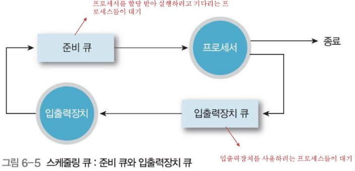

# CPU 스케줄링
운영체제가 프로세스들에 공정하고 합리적으로 CPU 자원을 배분하는 것

- 필요성
    - 컴퓨터 성능과 직결된다.
    - 배분을 잘 되지 않으면 무질서한 상태가 발생한다.

# 프로세스 우선순위
- 대부분의 프로세스들은 CPU와 입출력 장치가 실행 상태와 대기 상태를 반복하며 실행된다.
- CPU 버스트와 입출력 버스트를 반복하며 실행된다.

*CPU 버스트(CPU를 이용하는 작업), 입출력 버스트(입출력장치를 기다리는 작업)

- 입출력 집중 프로세스(I/O bound process)
    - 비디오 재생이나 디스크 백업 작업을 담당하는 프로세스와 같이 **입출력 작업이 많은 프로세스**
    - 실행 상태보다 **대기 상태**에 더 많이 머무른다.

- CPU 집중 프로세스(CPU bound process)
    - 복잡한 수학 연산, 컴파일, 그래픽 처리 작업을 담당하는 프로세스와 같이 **CPU 작업이 많은 프로세스**
    - 대기 상태보다 **실행 상태**에 더 많이 머무른다.

- 입출력 집중 프로세스와 CPU 집중 프로세스가 동시에 CPU 자원 요구를 한다면
    - 입출력 집중 프로세스를 가능한 한 빨리 실행시켜 끊임없이 작동시킨 후, CPU 집중 프로세스에 집중적으로 할당하는 것이 효율적이다.
    - 입출력장치는 작업을 완료하기 전까지는 어차피 대기 상태가 될 예정이기 대문이다.

- 각 프로세스의 PCB에 우선순위를 명시하고, 그 기준으로 먼저 처리할 프로세스를 결정한다.

# 스케줄링 큐
- CPU 자원을 요구하는 경우 뿐만 아니라 메모리 적재를 요청하는 경우, 특정 입출력장치와 보조기억장치를 사용하길 원하는 프로세스도 여러개 있을 수 있다.
    - 매번 PCB를 검사하여 순서를 결정하는 것은 비효율적

- 운영체제는 프로세스들에 줄을 세우고, 이 줄을 스케줄링 큐로 구현하고 관리한다.
    - 메모리에 적재되고 싶은 프로세스들, CPU를 이용하고 싶은 프로세스들, 특정 입출력장치를 이용하고 싶은 프로세스들 모두 줄을 세운다.
        - 준비 큐 : CPU를 이용하고 싶은 프로세스들이 서는 줄
        - 대기 큐 : 입출력장치 이용을 위해 대기 상태에 접어든 프로세스들이 서는 줄
        
        
    - 삽입된 순서대로 프로세스를 하나씩 꺼내어 실행하되, 우선순위가 높은 프로세스를 먼저 실행한다. -> 다음 발표

### 선점형 스케줄링
- 프로세스가 CPU를 비롯한 자원을 사용하고 있더라도 운영체제가 프로세스로부터 자원을 강제로 빼앗아 다른 프로세스에 할당할 수 있는 스케줄링 방식
- 어느 하나의 프로세스가 자원 사용을 독점할 수 없다.
    - 장점 : 어느 한 프로세스의 자원 독점을 막고, 골고루 자원 배분할 수 있다.
    - 단점 : 문맥 교환 과정에서 오버헤드 발생 가능성

### 비선점형 스케줄링
- 하나의 프로세스가 자원을 사용하고 있다면 그 프로세스가 종료되거나 스스로 대기 상태에 접어들기 전까지는 다른 프로세스가 끼어들 수 없는 스케줄링 방식
- 하나의 프로세스가 자원 사용을 독점할 수 있는 스케줄링 방식
    - 장점 : 오버헤드 발생 가능성이 적다.
    - 단점 : 모든 프로세스가 골고루 자원을 사용할 수 없다.