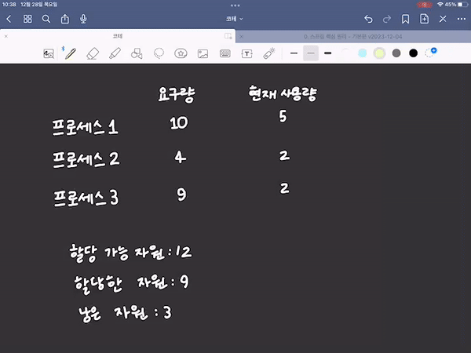
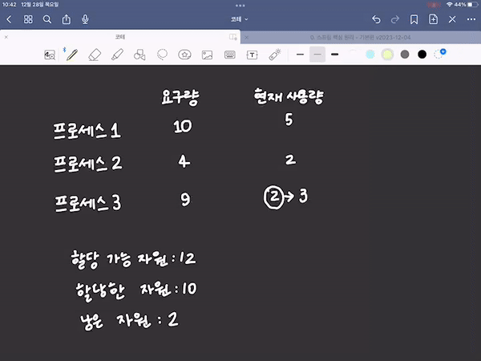

### 식사하는 철학자 문제

-   일어나지 않을 사건을 기다리며 진행이 멈춰 버리는 현상

철학자 = 프로세스 혹은 스레드  
포크 = 자원(임계 구역)  
생각하는 행위 = 자원을 기다리는 것

교착 상태를 해결하기 위해서

1.  교착 상태가 발생했을 때의 상황을 정확히 표현한다.
2.  교착 상태가 일어나는 근본적인 이유에 대해 알아야 한다.

## 자원 할당 그래프

1.  프로세스는 원으로, 자원의 종류는 사각형으로 표현한다.
2.  사용할 수 있는 자원의 개수는 자원 사각형 내에 점으로 표현한다.
3.  프로세스가 어떤 자원을 할당받아 사용 중이라면 자원에서 프로세스를 향해 화살표를 표시한다.
4.  프로세스가 어떤 자원을 기다리고 있다면 프로세스에서 자원으로 화살표를 표시한다.  
    예시 1)
    

    예시 2)
    

교착 상태가 발생한 자원 할당 그래프는 원의 형태를 띄고 있다.

## 교착 상태 발생 조건

1.  상호 배제

-   근본적인 원인은 해당 자원을 한 번에 하나의 프로세스만 이용 가능하기 때문이다.

2.  점유와 대기

-   어떠한 자원을 할당받은 상태에서 다른 자원을 할당받기를 기다리는 상태

3.  비선점

-   어떤 프로세스도 다른 프로세스의 자원을 강제로 빼앗지 못한다.

4.  원형 대기

-   자원 할당 그래프가 원의 형태로 그려지면 교착 상태가 발생할 수 있다.
-   예외  

예외 상황

1.  **시간 제한을 갖는 자원 할당**: 프로세스들이 자원을 요청할 때, 일정 시간 이내에 자원을 할당받지 못하면 요청을 자동으로 취소하고 다시 시도합니다. 이러한 시스템에서는 프로세스들이 원형으로 자원을 기다리지만, 시간 제한으로 인해 교착 상태에 빠지지 않습니다.
2.  **자원을 부분적으로만 요청하고 사용하는 경우**: 프로세스들이 필요한 자원의 일부만을 먼저 요청하고, 나머지 자원은 사용 가능해질 때 요청합니다. 이 경우, 자원이 순차적으로 해제되면서 다른 프로세스가 이를 사용할 수 있게 되어 교착 상태를 피할 수 있습니다.
3.  **우선순위 기반 자원 할당**: 시스템이 프로세스에 우선순위를 할당하고, 높은 우선순위의 프로세스가 자원을 요청할 때 낮은 우선순위의 프로세스가 자원을 해제하도록 하는 방식입니다. 이 경우, 원형 대기 상태는 발생할 수 있지만, 우선순위에 따라 자원이 재할당되어 교착 상태에 빠지지 않습니다.

# 교착 상태 해결 방법

## 교착 상태 발생 조건을 제거한다.

### 자원의 상호 배제를 없애 모든 자원을 공유 가능하게 만든다.
이론적으로는 교착 상태를 없앨 수 있지만, 현실적으로 모든 자원의 상호 배제를 없애기는 어려워 무리가 있다.

### 점유와 대기를 없애 특정 프로세스에 자원을 모두 할당하거나, 아예 할당하지 않는 방식으로 배분한다.
자원의 활용률이 낮아질 수 있다.
- 한 프로세스에 필요한 자원들을 몰아주고, 그 다음에 다른 프로세스에 필요한 자원들을 몰아줘야 한다.
- 당장 자원이 필요해도 기다릴ㅅ 수 밖에 없는 프로세스와 사용되지 않으면서 오랫동안 할당되는 자원이 대량으로 생겨나게 된다.
- 많은 자원을 사용하는 프로세스는 동시에 자원들을 사용할 타이밍을 확보하기가 어려워 기아 현상이 발생하게 된다.

### 비선점 조건을 없애 자원을 이용 중인 프로세스로부터 해당 자원을 빼앗을 수 있다.
CPU가 대표적인 예시이다.
- 일정 시간이 지나면 작업이 끝나지 않아도 다른 프로세스가 CPU를 할당받아 사용할 수 있다.

하지만 프린터와 같은 경우에는 비선점 조건을 없앨 수 없어 다소 범용성이 떨어지는 방안이다.

### 원형 대기 조건을 없애 자원을 정렬하면 원형 대기가 발생하지 않는다.
앞선 세가지 방식에 비해서는 비교적 현실적이고 실용적인 방식이다.
모든 컴퓨터 시스템 내에 존재하는 수많은 자원에 번호를 붙여 정렬하는 것은 간단한 작업이 아니고, 어떻게 정렬하느냐에 따라 특정 자원의 활용률이 떨어질 수 있다.

## 교착 상태 회피
프로세스들에 배분할 수 있는 자원의 양을 고려하여 교착 상태가 발생하지 않을 정도의 양만큼만 자원을 배분하는 방식
- 안전 상태 : 모든 프로세스가 정상적으로 할당받고 종료될 수 있는 상태
- 불안전 상태 : 교착 상태가 발생할 수도 있는 상황
- 안전 순서열 : 교착 상태 없이 안전하게 프로세스들에 자원을 할당할 수 있는 순서

교착 상태 회피 방식은 항시 안전 상태를 유지하도록 자원을 할당하는 방식

## 교착 상태 검출 후 회복
교착 상태 발생을 인정하고 사후 조치를 하는 방식

### 선점을 통한 회복
교착 상태가 해결될 때까지 다른 프로세스로부터 자원을 강제로 빼앗고 한 프로세스에 할당하는 방식

### 프로세스 강제 종료를 통한 회복
교착 상태에 놓은 프로세스를 모두 강제 종료한다.
- 한 방에 해결하지만 그만큼 많은 프로세스들이 작업 내열을 잃게 될 가능성이 있다.

교착 상태가 없어질 때까지 한 프로세스씩 강제 종료할 수도 있다.
- 작업 내역을 잃는 프로세스는 최소화하지만 교착 상태가 없어졌는 지 확인하는 과정에서 오버헤드를 야기한다.

## 타조 알고리즘
드물게 발생하는 잠재적 문제를 무시로 대처하는 방식
- 문제 발생의 빈도나 심각서엥 따라 최대 효율을 추구하는 상황에서 적합할 때도 많다.