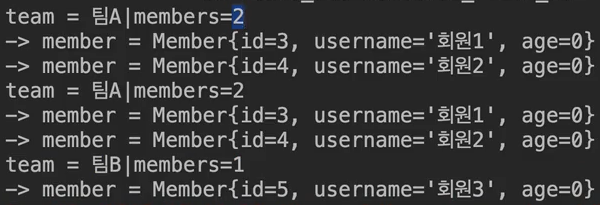

# JPQL의 페치 조인 (Fetch Join)

## 🌟 페치 조인이란?
페치 조인은 JPQL에서 성능 최적화를 위해 사용하는 고급 쿼리 기법입니다. 이는 주로 연관된 엔티티나 컬렉션을 SQL 한 번에 함께 조회하는 데 사용됩니다. @XToMany같은 관계에서 LAZY 로딩을 사용하면, 각 연관 엔티티에 접근할 때마다 추가 쿼리가 실행되는 N+1 문제가 발생하는데 이때 특히 유용합니다.

```java
// 페치 조인의 기본 구문
JOIN FETCH 조인경로
```

## 🚀 페치 조인 사용 예제(@XToOne)
페치 조인은 특정 엔티티를 조회하면서 연관된 다른 엔티티도 함께 조회하는 기능입니다.

#### `예시 상황`
- 회원을 조회하면서 연관된 팀도 함께 조회 할때
- 변환된 SQL을 보면 회원 뿐만 아니라 팀(T.*)도 함께 선택됨

#### `장점`
- 기존 SQL JOIN을 활용하면 N+1번 쿼리 조회
    - 1은 Member N은 Team 수
    - fetch는 한방에 조회

### JPQL 예제 (default : inner)
```java
select m from Member m join fetch m.team
```

### SQL 변환
```sql
SELECT M.*, T.* FROM MEMBER M
INNER JOIN TEAM T ON M.TEAM_ID = T.ID
```


##### 출처 : 자바 ORM 표준 JPA 프로그래밍 - 김영한

## 📚 컬렉션 페치 조인(@XToMany)
일대다 관계에서 사용되며, 한 엔티티와 연관된 컬렉션 엔티티들을 한 번의 쿼리로 조회합니다.

### JPQL 예제
```java
select t
from Team t join fetch t.member
where t.name = '팀A'
```

### SQL 변환
```sql
SELECT T.*, M.*
FROM TEAM T
INNER JOIN MEMBER M ON T.ID = M.TEAM_ID
WHERE T.NAME = '팀A'
```




##### 출처 : 자바 ORM 표준 JPA 프로그래밍 - 김영한

## 🌈 페치 조인과 DISTINCT
페치 조인에서 DISTINCT는 중복된 결과를 제거하는 데 사용됩니다. JPQL의 DISTINCT는 SQL에 DISTINCT를 추가하고 애플리케이션 수준에서도 중복을 제거합니다.

### JPQL 예제
```java
select distinct t
from Team t join fetch t.members
where t.name = '팀A'
```


##### 출처 : 자바 ORM 표준 JPA 프로그래밍 - 김영한


## 🛠️ 페치 조인의 특징과 한계
- **별칭 사용 제한**: 페치 조인 대상에는 별칭을 줄 수 없습니다. (별칭 부여는 가능, 사용은 불가)
- **컬렉션 제한**: 둘 이상의 컬렉션을 페치 조인할 수 없습니다. (단, 일대다 관계일때만, 일대일은 무관)
- **페이징 제한**: 컬렉션을 페치 조인하면 페이징 API 사용이 제한됩니다.

> @Query("SELECT a FROM Application a JOIN FETCH a.player p JOIN FETCH p.course")
    List<Application> findAllWithPlayerAndCourse();

## 🔍 페치 조인과 일반 조인의 차이
일반 조인은 연관된 엔티티를 함께 조회하지 않지만, 페치 조인은 연관된 엔티티도 함께 조회합니다.

## 🎯 페치 조인의 적용
- **객체 그래프 유지**: 페치 조인은 객체 그래프를 유지할 때 효과적입니다.
- **성능 최적화**: 연관된 엔티티들을 SQL 한 번으로 조회하여 성능을 최적화합니다.