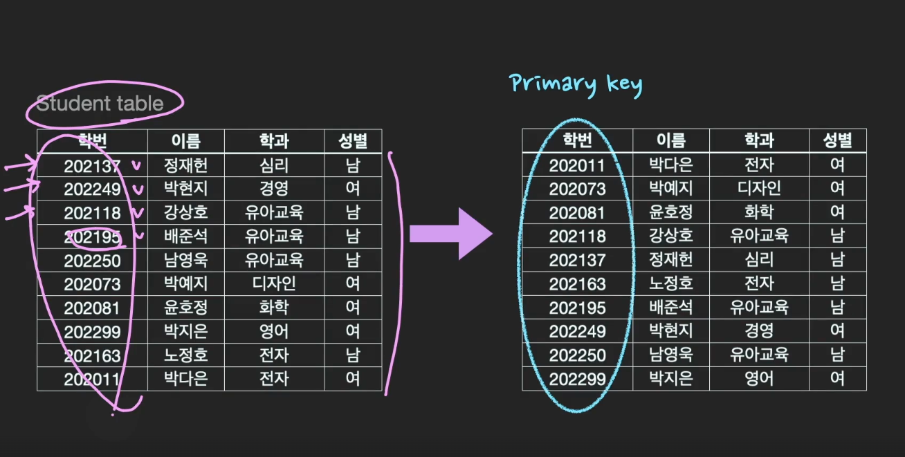
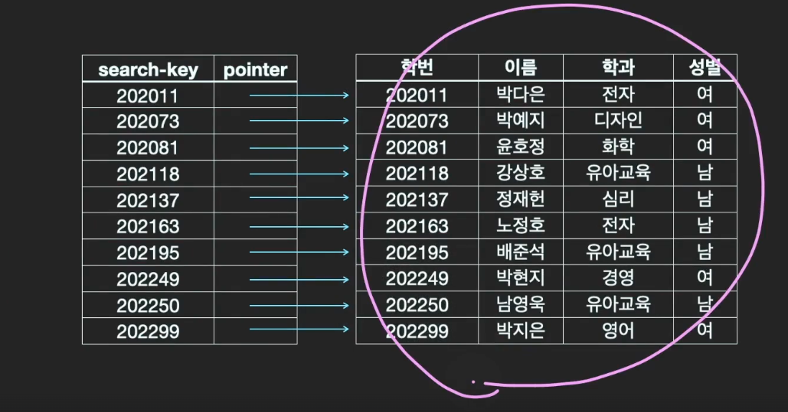
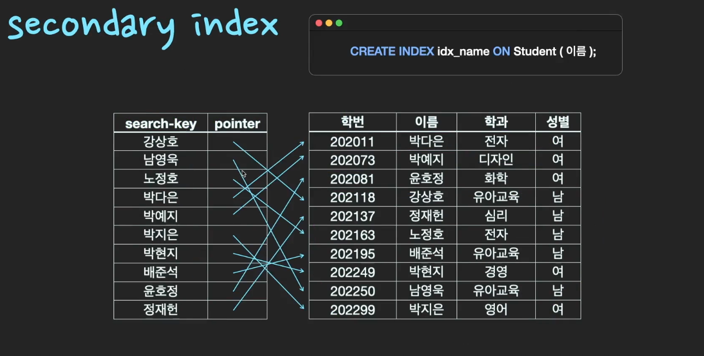

# Index 📖

## Database에서 Index는 무엇인가? 사용하는 이유는?

> DB table 검색(조회)성능을 높여주는 대표적인 방법

- `select`문으로 시작하는 SQL문으로 테이블을 검색할때 원하는 결과값을 가져오는데 걸리는 시간을 단축시킬 수 있다.
- RDBMS에서는 index는 `B+Tree`구조를 따른다.
- index라는 별도의 파일이 있기때문에 table을 `Full Scan`하지 않고 원하는 자료에 바로 접근이 가능하다.

## Index의 구조

- BTree, B+Tree, Hash, Bitmap 등등의 자료구조를 따른다.
- 테이블의 특정 Column(속성)을 기준으로 정렬한후 데이터의 물리적인 위치를 정렬한 위치에 저장한다.
- 별도의 파일이 생성된다.

특정 속성을 Index로 지정할 경우 다음과 같은 형태의 파일이 추가생성된다.

| Search-Key | Pointer                           |
| ---------- | --------------------------------- |
| A          | 테이블의 A에 해당하는 데이터 위치 |
| B          | 테이블의 B에 해당하는 데이터 위치 |
| C          | 테이블의 C에 해당하는 데이터 위치 |

### Clustering Index

- table당 하나의 Column에만 지정할 수 있다.
- 기본적으로 PK속성에 Clustering Index지정된다.
  - Pk값 기준으로 정렬되어서 데이터가 저장되는 이유

### Secondary Index

- table자체를 정렬하지는 않음
- `select * from student where ***` table full scan 대신 훨씬 바르게 탐색 가능

## Index의 장단점

- 장점 검색 속도의 향상

- 단점
  - index파일이 저장될 추가적인 공간이 필요하다 (table의 크기의 10%가 일반적)
  - 데이터의 추가작업(수정, 삭제 등)에 따른 추가작업이 필요하다

## 어떤 Column에 Index 설정을 해줘야 할까?

- `where`조건에 자주 조회되는 column
- 수정빈도가 낮은 column
- 카디널리티가 높은 column
  - 카디널리티 : 데이터가 중복되지 않은정도
  - ex) true, false vs 주민등록번호(고유한값) -> 후자의 경우가 카디널리티가 높다.

## Hash Table 구조가 시간복잡도가 적은데 B+Tree구조를 쓰는이유는?

> Hash Table 탐색 시간복잡도 O(1)
> B+ Tree 탐색 시간복잡도 O(log n)

- 특정 데이터를 탐색하는 경우 `HashTable`구조가 성능이 더 좋다.
- 하지만, 데이터탐색할 경우 특정 범위를 묶어서 가져오는 경우가 많다.
  - ex) select \* from where money < 1000
- B+Tree자료구조는 특정 search-key기준으로 정렬한후, 해당 Pointer들을 저장하는구조이다.
- 범위에 따른 데이터 탐색은 `B+Tree`구조가 성능적으로 더 우수하다.
