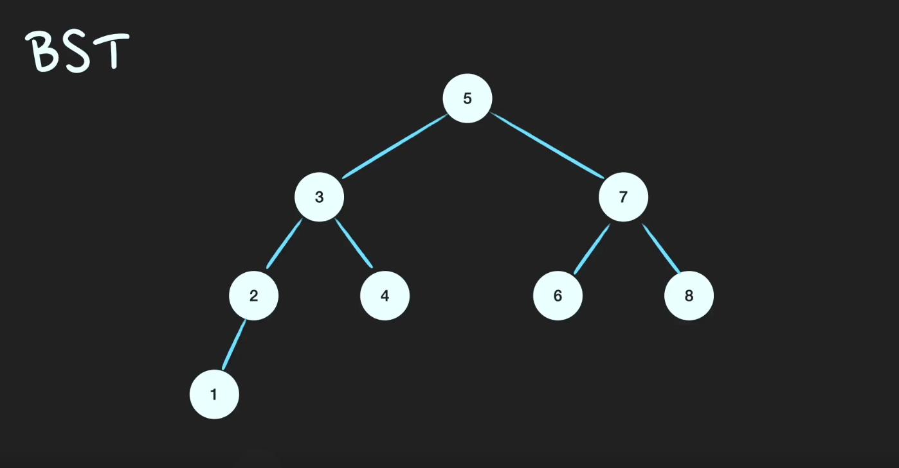
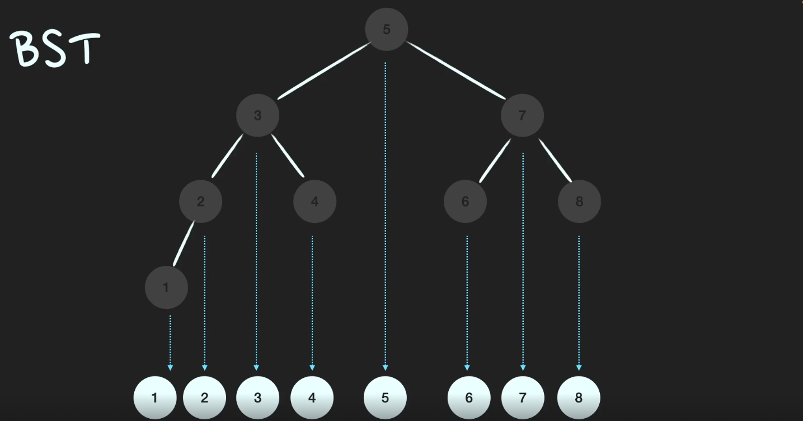
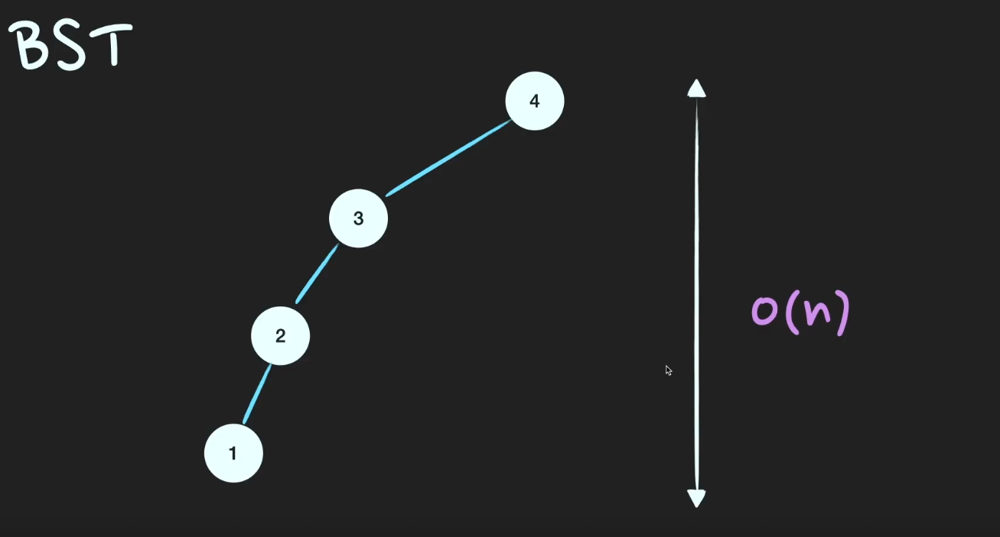

# BST (이진 탐색 트리)

> Binary Tree : 각각의 노드가 최대 2개의 자식 노드를 가지는 자료구조

- 저장과 동시에 정렬을 하는 자료구조

### BST가 되기위한 조건
1) Root Node값보다 작은 Node는 `왼쪽` SubTree, 큰 Node는 `오른쪽` SubTree에 저장된다.
2) SubTree도 1번의 조건을 따른다 (Recursive)

### 시간복잡도

- 검색: `O(logN)`
  - 자료구조의 높이만큼 시간복잡도가 발생

- 검색(Worst Caset) : `O(N)`
  - 자료구조가 균형을 잃고 한쪽으로 치우친 케이스 

