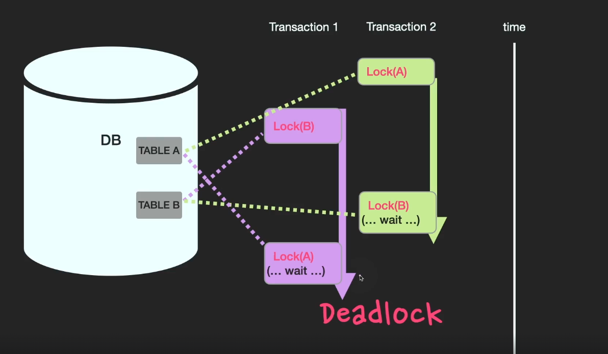

## Deadlock (교착상태)

여러개의 transaction이 동시에 병행적으로 이루어질때 동시성 제어를 위해 특정 table에 대해 `Locking`상태를 걸게 된다. 서로의 table이 `Lock` 상태가 되어 더이상의 작업을 진행할 수 없는 상태를 교착상태라고 일컫는다.



```sql
Transaction 1>start transaction;insertinto Bvalues(1);
Transaction 2>start transaction;insertinto Avalues(1);
```
여기서 트랜잭션을 commit 하지 않은채 서로의 첫번째 행에 대한 잠금을 요청하면 Deadlock이 발생한다.
```
Transaction 1>insertinto Avalues(1);
Transaction 2>insertinto Bvalues(1);

ERROR 1213 (40001): Deadlock foundwhen tryingtoget lock; try restarting transaction
```

### 해결방법

#### 예방기법
각각의 트랜잭션 실행전 트랜잭션에 필요한 모든 자원에 대해 Lock을 한다. 단, 각각의 트랜잭션들의 병행성이 떨어진다.

#### 회피기법
자원을 할당할때 `timestamp`을 활용하여 교착상태를 회피한다.

#### 탐지 / 회복기법
트랜잭션 실행전 아무런 검사하지않고 deadlock이 발생하면 감지 후 회복하는 방법이다.