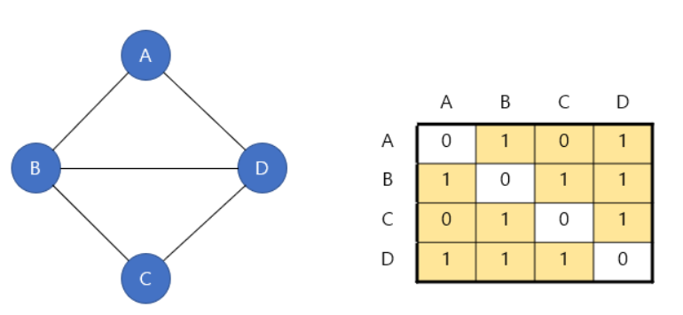
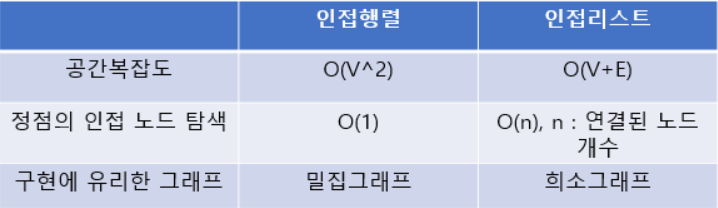
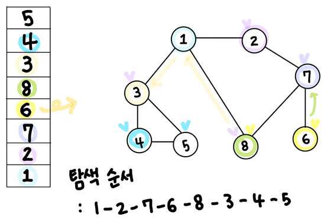
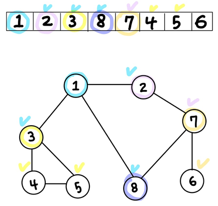

# Graph
Node(정점)와 Edge(간선)로 이뤄져 각 node들이 연결되어 시각적으로 나타낼 수 있으며, 해당 노드 간의 관계를 설명하는 자료 구조

* 그래프와 트리의 차이점
  

## 특징
1. 네트워크 모델 (망 모형)
: 오브젝트와 이에 대한 관계를 나타내는 유현한 방식으로 이해할 수 있는 데이터베이스 모델  
2. 2개 이상의 경로가 가능하다. -> 노드들 사이에 무방향/방향에서 양방향 경로를 가질 수 있다.
3. Self-Loop 뿐만 아니라 Loop/Circuit 모두 가능하다.
4. 부모-자식 관계 개념이 없다.
5. 간선의 유무는 그래프에 따라 다르다.

사용 예) 
- 노드 간의 관계 파악으로 SNS 관계도 및 도로상의 차량 정보를 바탕으로 한 운송 서비스나 기타 경로 파악 
- 공간 데이터를 활용해 상권파악이나 기타등등의 다양한 산업에서 적용할 수 있다.

# Graph 종류
## 방향성과 무방향성

### Directed (방향성)
: 첫 노드부터 끝 노드까지 일련의 일관된 방향이 있는 경우 방향성으로 판단
- 일방향성 : 내부의 노드간 순환의 방향이 **한쪽**으로 순환
- 양방향성 : 내부의 노드간 순환의 방향이 **양쪽**으로 순환

### Undirected (무방향성)
: 노드 간 연결이 따로 방향성을 띄지 않고 연결되어 있는 모든 노드가 서로 상호 관계를 갖는다.

## 순환과 비순환

### Cyclic(순환)
: 내부에서 방문했던 노드를 다시 방문하게 되는 경우
### Acyclic(비순환)
: 내부에서 재방문이 진행 안되는 방향으로 구성

## 연결과 비연결 그래프
### Connected Graph(연결 그래프)
: 모든 정점에 대해 항상 경로를 가지는 그래프

### Disconnected Graph(비연결 그래프)
: 정점들 사이에 간선이 존재하지 않아 경로가 없는 경우가 존재하는 그래프

## Weighted Graph(가중치 그래프)

: 간선에 비용 또는 가중치(정보)가 할당된 그래프 (=네트워크)

예) 도시-도시 연결, 도로의 길이, 회로 소자의 용량, 통신망의 사용료 등
* 도로 지도의 경우, 두 곳의 최단 경로를 검색할 때에는 두 정점 간의 모든 경로에서 변의 가중치 합이 최소가 되는 경로를 찾는다.

## Complete Graph(완전 그래프)

: 모든 정점이 서로 하나의 간선으로 연결되어 있는 그래프

**무방향 완전 그래프의 경우, 정점이 n개일 때, 간선의 수는 n*(n-1)/2이다.

## 희소와 밀집
### Sparse Graph(희소 그래프)

: 정점의 개수보다 간선 개수가 적은 그래프

### Dense Graph(밀집 그래프)

: 정점의 개수보다 간선 개수가 많은 그래프

다음 시간에

# 그래프의 구현
## 인접 행렬 
### 무방향 그래프

: 정점들을 배열의 인덱스로 표현하여, 두 정점이 연결되어 있다면 1로, 연결되어 있지 않다면 0으로 표현한다.

### 방향 그래프

: 해당 정점에서 다른 정점으로 가는 간선이 있다면 1로, 없다면 0으로 표현한다.

## 인접 리스트(Adjacent List)

### 무방향 그래프
: 각 정점을 head로 시작해 인접한 노드들을 전부 연결 리스트로 연결한다.

### 방향 그래프
: 각 정점을 head로 시작해 들어가는 노드를 전부 연결리스트로 연결한다.

* 연결 리스트에 정점이 입력되는 순서에 따라 연결 리스트 내에서 정점의 순서가 달라질 수 있지만 표현의 일관성을 위해 오름차순으로 연결된다고 가정한다.

## 어떤 방법이 더 유리할까? 

 예시 

만약 정점은 1000개가 있는데 간선은 5개 뿐인 그래프가 있다고 하자. 이렇게 간선의 수가 적은 그래프를 희소 그래프(sparse graph)라고 한다. 이때 이 그래프를 인접행렬로 구현한다면, 오직 5개의 연결(간선)을 나타내기 위해 1000x1000행렬을 사용해야한다. 하지만 인접리스트로 구현하게 되면 1005개의 노드만 있으면 충분하다. ( 정점노드(head) 1000개 + 연결된 간선노드 5개) 정확히 따지자면 인접행렬의 공간복잡도(Space Complexity)는 O(V^2) 이고 연결리스트의 공간복잡도(Space Complexity)는 O(V+E) 이다 (V-정점의개수, E-간선의 개수) 따라서 인접리스트는 희소 그래프를 표현하는데 적당한 방법이다.

반면 1000개의 정점이 있고, 간선이 2000개가 있는 그래프가 있다고 하자. 이렇게 간선의 수가 많은 그래프를 밀집 그래프(dense graph)라고 한다. 이 때는 인접행렬로 그래프를 구현하는게 더 효과적이다. 그 이유가 무엇일까? 그것은 바로 행렬의 접근성 때문이다. 어떤 정점이 다른 정점과 연결되었는지 파악할 때 인접행렬은 인덱스를 이용하므로 O(1) 이면 충분하지만, 인접리스트는 head로부터 시작해서 해당 노드를 찾을 때까지 탐색을 진행해야 하므로 시간이 더 많이 걸린다.

#그래프 탐색 알고리즘

## DFS(DEpth First Search) : 깊이 우선 탐색
: Stack을 사용하여 한 정점으로만 나아간다.

### 동작 과정
1. 탐색 시작 노드를 스택에 삽입하고 방문 처리를 한다.
2. 스택의 최상단 노드에 방문하지 않은 인접한 노드가 하나라도 있으면 그 노드를 스택에 넣고 방문 처리한다. 방문하지 않은 인접 노드가 없다면 스택에서 최상단 노드를 꺼낸다.
3. 더 이상 2번의 과정을 수행할 수 없을 때까지 반복
* 방문 기준 : 번호가 가장 낮은 인접 노드부터

## BFS(Breadth First Search) : 너비 우선 탐색
: Queue를 사용해서 한 정점으로부터 연결되어 있는 모든 정점으로 나아간다.

### 동작 과정
1. 탐색 시작 노드를 큐에 삽입하고 방문 처리를 한다.
2. 큐에서 노드를 꺼낸 뒤에 해당 노드의 인접 노드 중에 방문하지 않은 노드를 모두 큐에 삽입하고 방문 처리 한다.
3. 더 이상 2번의 과정을 수행할 수 없을 때까지 반복한다.

