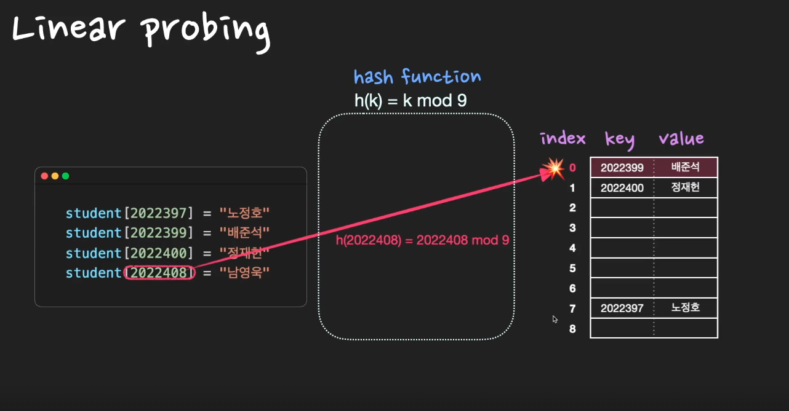
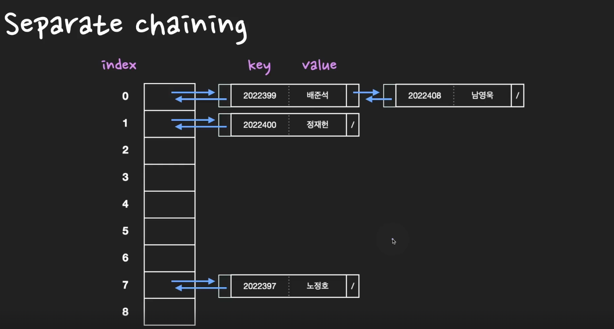

# Hash Table (해시테이블) 예상질문

> 빠른 탐색을 위한 자료구조

> 저장, 삭제, 검색 O(1) 시간복잡도를 가진다.

### 직접 주소화방법
- 데이터가 key - value 형태로 있다고 가정
- key값이 배열의 Index가 되어 저장

### 직접 주소화방법 문제점
- 불필요한 공간낭비
  - [158785] - 'kim'
  - [188728] - 'lee'

- key값에 다양한 자료형 불가
  - ['divme'] - 'kim'
  - ['duvuenmd'] - 'lee'

## 해시테이블 저장방법

- `key - value`형식으로 이루어진 데이터 중 key값을 `hash function`에 의해 `해시값 생성`
- `h(k)`가 데이터의 Index
- key - value는 그대로 데이터저장

- 좋은 hash function 기준
  - 연산 속도가 빨라야 한다.
  - 해시값이 최대한 겹치지 않아야 한다.

## 해시테이블 충돌 (Collision)

- 해시값에 중복이 발생하여 기존에 데이터가 있고 추가로 데이터가 들어가야할 경우 `충돌`이 발생했다고 한다.

### Open Addressing
미리 정한 규칙에 따라 비여있는 Slot을 찾아 그곳에 데이터를 저장한다.

추가적인 메모리 사용하지 않는 방식이다.

1) 선형 조사법 - 충돌이 발생한 해시값으로 부터 일정한 값만큼 이동 (+1, +2, +3 )
2) 이차 조사법 - 충돌이 발생한 해시값으로 부터 일정한 제곱값만큼 이동(+1^2, +2^2, +3^2)

하지만, `Clustering`현상이 발생하여 데이터 탐색 시간이 증가하게 된다.

3) 이중 해싱 - 2개의 해시함수를 사용
   1개의 해시함수로 최초의 해시값 생성

   나머진 해시함수는 충돌이 발생할 경우, 얼마만큼 이동해야할 지 이동의 폭을 정해주는 함수

### Seperate Chaining

데이터를 직접 저장하는 구조가 아니라 `Linked List`에 데이터 추가

- 삽입: O(1)
- 검색: O(1)
- worst 검색: O(n)
- 삭제: O(1)
- worst 삭제: O(n)