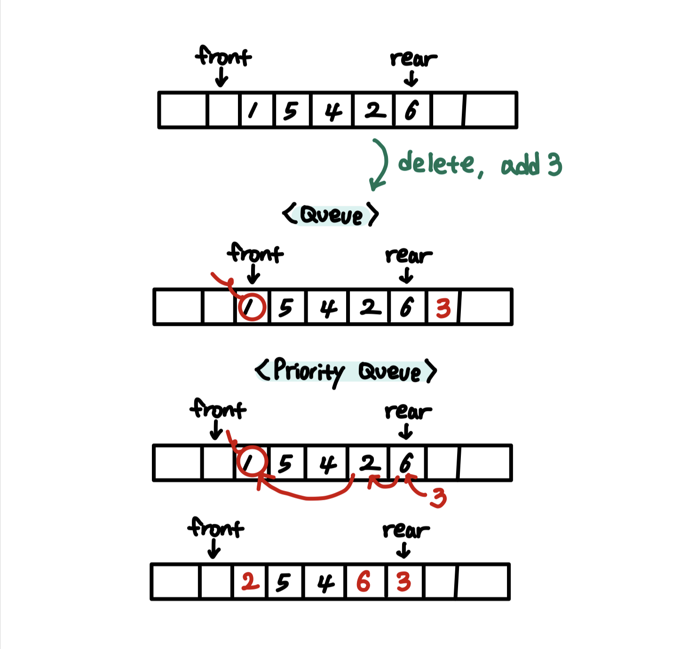
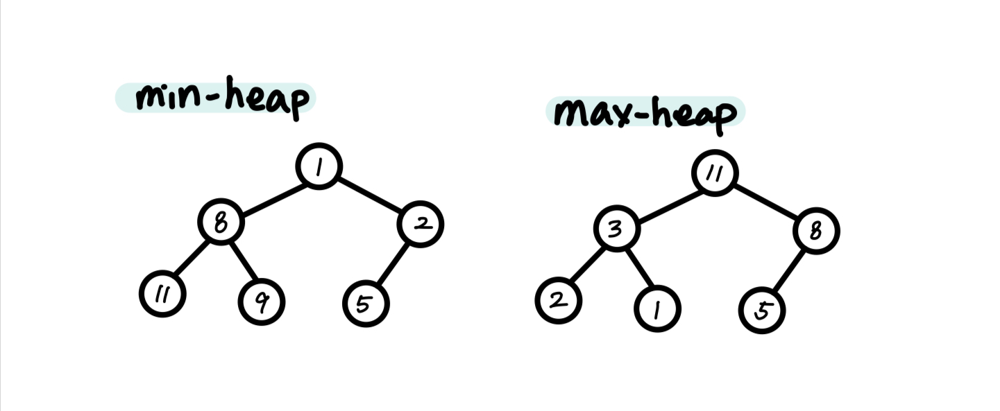
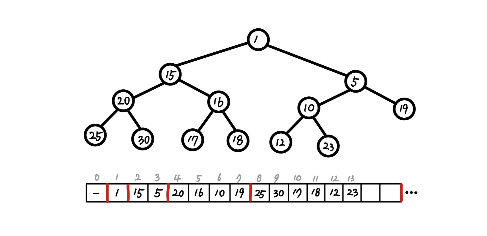
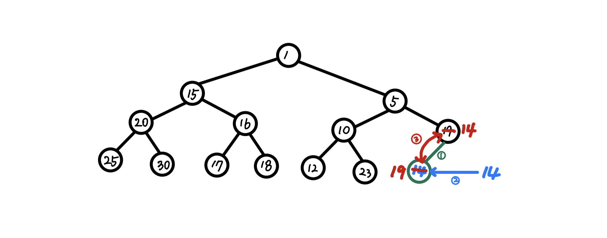
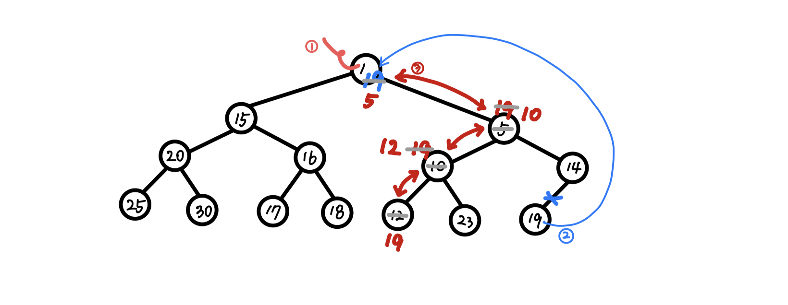
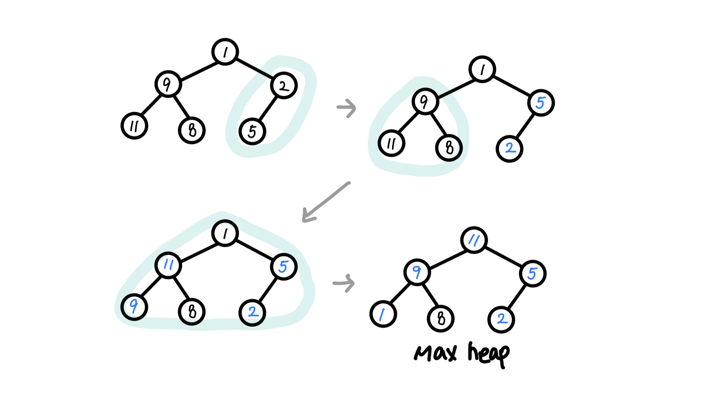

# Heap

## 우선순위 큐

- 큐(Queue) : FIFO (First-In-First-Out) 구조
- 우선순위 큐(Priority Queue) : 대기 리스트에 들어온 순서와 상관 없이, **'우선순위가 높은 것부터'** 처리한다.
- 예) 운영체제 작업 스케쥴링, 네트워크 트래픽 제어

## 힙 (Heap)

### 1. 우선순위 큐를 '트리 형태'로 구현한 자료구조

- <U>**부분적으로 정렬**</U>된 <U>**완전 이진 트리**</U>
  - 부분적 정렬 = 반정렬 상태(느슨한 정렬 상태)
- 부모 노드의 우선순위는 자식 노드보다 높다.
- 이진 탐색 트리와 달리 중복값을 허용한다.

### 2. 부모 - 자식 노드 간 일정한 대소관계를 유지해야 한다

    * 부모 < 자식 : 최소힙
        → 루트 = 최소값
    * 부모 > 자식 : 최대힙
        → 루트 = 최대값

- 따라서 주로 데이터의 최대값/최소값을 빠르게 찾아내야 하는 경우 사용됨

### 3. 구현 방식 : 배열

- cf) 일반적인 트리 구현 방식 : 연결 리스트
- 힙은 <U>완전 이진 트리</U>이므로, 배열로 구현해도 메모리 낭비를 발생시키지 않음
- 연결리스트에 비해 삽입 및 삭제 연산이 효율적

- 구현을 용이하게 하도록 index 0은 비워두고, root index = 1로 가정함
  - 왼쪽 자식 노드 인덱스 = i
  - 오른쪽 자식 노드 인덱스 = i + 1
  - 두 노드의 부모 인덱스 = i/2 (i > 1일 때)

---

### 4. Heap의 연산

- ### 삽입 연산

  힙의 크기를 늘려 새로운 노드를 마지막에 삽입하고,  
  힙 속성이 복원될 때까지 부모 노드와 값을 비교하며 위치를 이동(재구조화; heapify)한다.

  - 재구조화(heapify) : 힙의 조건을 만족하도록 노드의 위치를 바꾸는 과정

`1. 힙의 크기를 하나 증가시킨다.`  
 `2. 마지막 위치에 데이터를 삽입한다.`  
 `3. 부모 노드와 비교하여 값이 작다면(최대힙인 경우, 크다면) 위치를 교환한다.`  
 `4. 더이상 교환할 필요가 없을 때 삽입은 종료된다.`

---

- ### 삭제 연산

  우선순위가 가장 높은 데이터를 반환한다.  
   마지막 노드 값을 루트로 옮기고, 힙 속성이 복원될 때까지 값을 비교하며 위치를 이동한다.

`1. 루트의 값을 반환한다.`  
 `2. 가장 마지막 노드의 값을 루트로 이동시키고, 힙의 크기를 하나 감소시킨다.`  
 `3. 두 자식노드의 크기를 비교해 더 작은(큰) 값과 루트 노드의 위치를 교환한다.`  
 `4. 힙의 속성인 부모-자식 대소 관계가 성립되면 삭제 연산을 종료한다.`

---

- ### 힙 만들기(build heap)

  힙이 아닌 배열을 힙으로 만드는 과정

  - 가장 말단 작은 단위의 부모-자식 노드부터 차례로 heapify를 진행한다.

- ### 시간복잡도
  - 삽입, 삭제 모두 연산 자체는 $O(1)$
  - 그러나, 최소(최대)힙의 조건을 만족하도록 재구조화(heapify)하는 과정을 거치므로 $O(logN)$의 시간 복잡도를 가짐
  - cf) 배열을 통해 최대/최소값을 찾는 경우 : $O(N)$
  - 힙 만들기(build heap) : $O(NlogN)$
