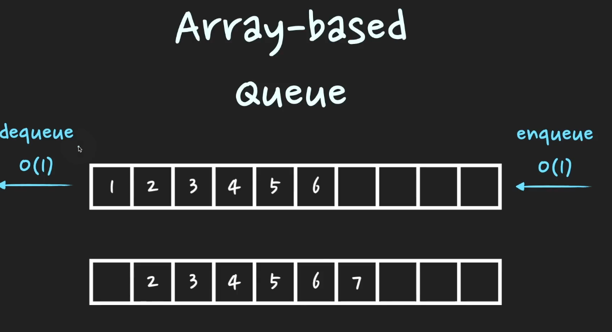
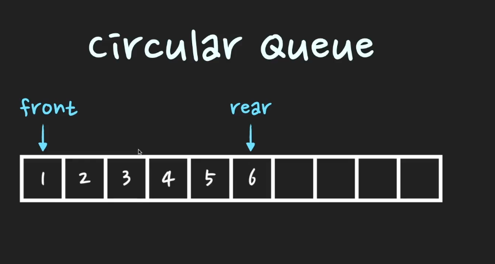
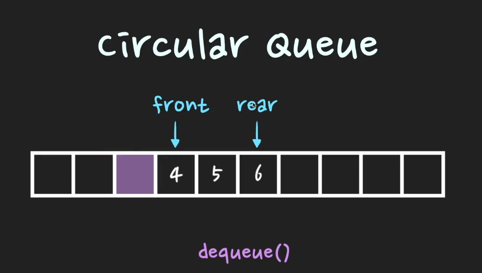
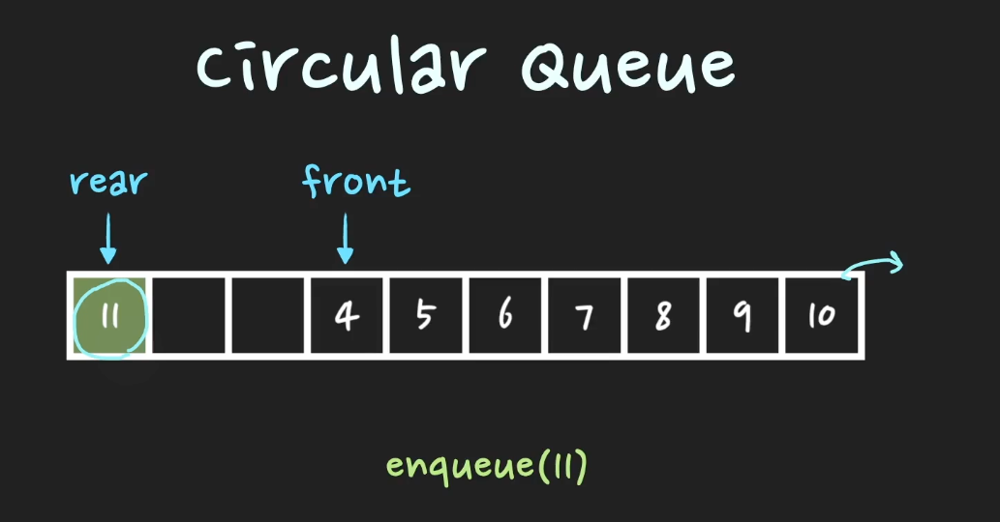
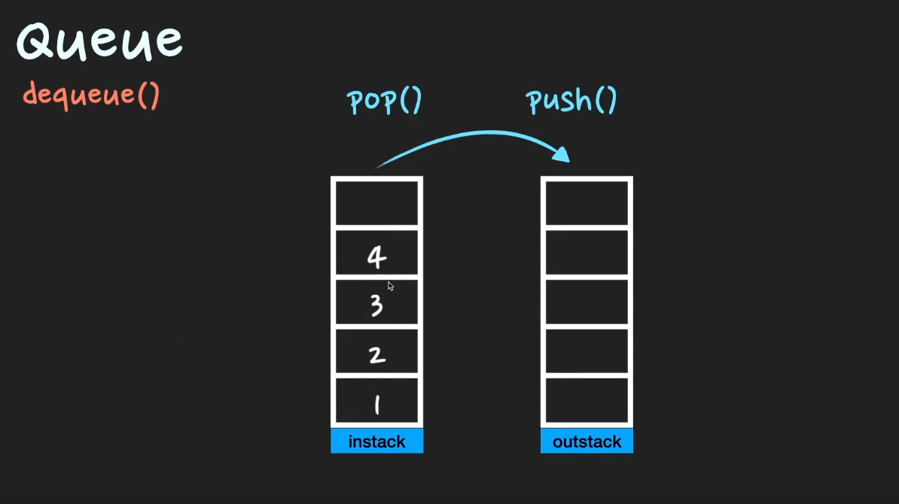

# 큐 (Queue)

> 선입선출(FIFO) 자료구조

> enqueue -> O(1), dequeue -> O(1)

### 활용되는 사례
- Cache 구현
- 프로세스 관리
- BFS 너비우선 탐색

## 구현방식

### Array Based


`dequeue`를 하게될 경우 이미 할당된 메모리 사이즈내에서 비효율성을 가지게 된다.





- 이미 할당된 메모리 사이즈를 최대한 활용할 수 있다.
- 하지만, 이미 할당된 메모리 사이즈를 넘어서 `enqueue`할 경우 dynamic array 특징인 `resizing`해줘야 한다. O(n)

### Linked Based
- `Linked List`로 구현하는 방식
- `enqueue`, `dequeue`시 메모리를 새로 할당해서 연결한다.
- 메모리의 낭비는 없지만 메모리 할당시 전반적인 속도는 array based 방식보다 시간이 걸린다.

### Stack 2개를 이용해서 Queue 구현하기
- `enqueue` 구현하기
  - instack에 `push`
  - O(1)

-  `dequeue`를 구현하기 
   - outStack이 만약 비어있다면
   - instack pop 실행
   - outstack push 실행
   - outstack pop 실행
   - O(1), worst case: O(n)



#### 코드구현하기 (with Python)
```python
class Queue(object):
  def __init__(self):
    self.instack = []
    self.outstack = []

    def enqueue(self, element):
      self.instack.append(element)

    def dequeue(self):
      if not self.outstack:
        while self.instack:
          self.outstac.append(self.instack.pop())
      return self.outstack.pop()
```

### 우선순위 큐
- 시간순서대로 저장되는 일반 큐와 다르게 `우선순위`에 따라 위치가 조정되는 자료구조이다.

- 구현방법: `heap tree` -> `완전 이진트리`
  - ex) max heap : 각각의 node 값들은 자신들의 child node들의 값보다 크다.
  - ex) min heap : 각각의 node 값들은 자신들의 child node들의 값보다 작다.
- 트리는 Linked List가 일반적이나 `Array`로 구현가능
- Array[0]는 비어둔다.
- Root node 기준(n) left node `2n`, right node `2n+1` -> 완전 이진트리 특징을 이용
- heap tree의 높이는 `logN`


#### Push
- 인덱스의 제일 마지막으로 들어간 후 조건에 맞춰서 node들을 `swap`한다.
- 최대 실행 횟수는 heap tree의 높이 만큼 `O(logn)`이다.

### Pop
- 대상이 되는 노드 제거
- 제일 마지막 인덱스인 노드가 빈공간 대체
- 조건에 맞춰서 node들을 `swap`한다.
- 최대 실행 횟수는 heap tree의 높이 만큼 `O(logn)`이다.