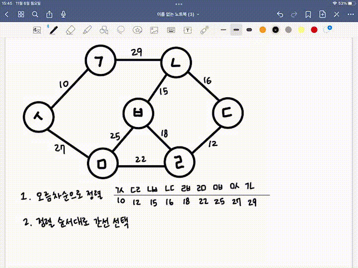
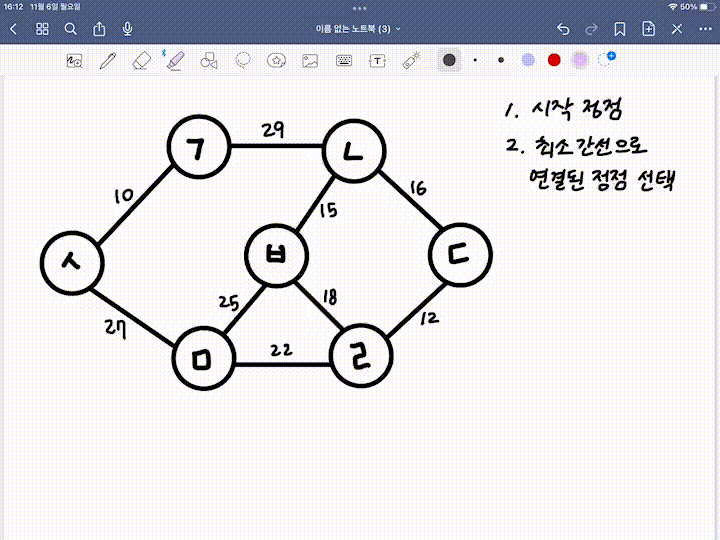

# Spanning Tree

## 정의
- 그래프의 최소 연결 부분 그래프
- 최소 연결 = 최소 간선의 수
- n개의 정점을 가지는 그래프의 최소 간선의 수는 n-1개이고, n-1개의 간선으로 연결되어 있으면 필연적으로 트리 형태가 된다.
- **그래프에서 일부 간선을 선택해서 만든 트리**

## 특징
1. DFS, BFS을 이용하여 그래프에서 신장 트리를 찾을 수 있다.
    - 탐색 도중에 사용된 간선만 모은다.

2. 하나의 그르패에는 많은 신장 트리가 존재할 수 있다.
3. Spanning Tree는 트리의 특수한 형태
    - 모든 정점들이 연결되어 있어야 한다.
    - 사이클을 포함하지 않는다.
4. n개의 정점을 n-1개의 간선으로 연결한다.

## 사용 예시

### 통신 네트워크 구축

- 회사 내의 모든 전화기를 가장 적은 수의 케이블을 사용하여 연결하고자 하는 경우
- n개의 위치를 연결하는 통신 네트워크를 최소의 링크를 이용하여 구축하고자 하는 경우, 최소 링크의 수는 n-1개가 되고, 따라서 Spanning Tree가 가능해진다.

---

# MST(Minimum Spanning Tree)

## 정의
### 최소 신장 트리
: Spanning Tree 중에서 사용된 간선들의 가중치 합이 최소인 트리

- 각 간선의 가중치가 동일하지 않을 때 단순히 가장 적은 간선을 사용한다고 해서 최소 비용이 얻어지는 것이 아닌, 간선에 가중치를 고려하여 최소 비용을 선택하는 것이다.
- **네트워크에 있는 모든 정점들을 가장 적은수의 간선과 비용으로 연결하는 것**

*네트워크 : 가중치를 간선에 할당한 그래프

## 특징
1. 간선의 가중치의 합이 최소여야 한다.
2. n개의 정점을 가지는 그래프에 대해 반드시 (n-1)개의 간선만을 사용해야 한다.
3. 사이클이 포함되어서는 안된다.

## 사용 예시

### 통신망, 도로망, 유통망에서 길이, 구축 비용, 전송 시간을 최소로 구축하는 경우

1. 도로 건설
    - 도시들을 모두 연결하면서 도로의 길이가 최소가 되도록 하는 문제
2. 전기 회로
    - 단자들을 모두 연결하면서 전선의 길이가 최소가 되도록 하는 문제
3. 통신
    - 전화선의 길이가 최소가 되도록 전화 케이블 망을 구성하는 문제 

---

# MST 구현 방법

## Kruskal MST 알고리즘
네트워크의 모든 정점을 최소 비용으로 연결하는 방법

- MST가 조건에 근거하여 각 단계에서 사이클을 이루지 않는 최소 비용 간선을 선택한다.
- **간선 선택**을 기반으로 하는 알고리즘
- 이전 단계에서 만들어진 신장 트리와는 상관없이 **무조건 최소 간선만을 선택하는 방법**이다.

### 과정
1. 그래프의 간선들을 가중치의 **오름차순**으로 정렬한다.
2. 정렬된 간선 리스트에서 순서대로 사이클을 형성하지 않는 간선을 선택한다.
    - 가장 낮은 가중치를 선택한다. 
    - 사이클을 형성하는 간선을 제외한다.
3. 해당 간선을 현재의 MST(최소 비용 신장 트리)의 집합을 추가한다.

### Kruskal 알고리즘 시간 복잡도
간선들을 정렬하는 시간에 좌우된다.
- 간선 e개를 퀵 정렬과 같은 효율적인 알고리즘으로 정렬한다면 O(elog2e)이다.

## Prim MST 알고리즘
시작 정점에서부터 출발하여 신장트리 집합을 단계적으로 확장하는 방법

- **정점 선택**을 기반으로 하는 알고리즘
- 이전 단계에서 만들어진 신장 트리를 **확장**하는 방법

### 과정
1. 시작 단게에서는 시작 정점만이 MST 집합에 포함된다.
2. 앞 단계에서 만들어진 MST 집합에 인접한 정점들 중에서 최소 간선으로 연결된 정점을 선택하여 트리를 확장한다.
    - 즉, 가장 낮은 가중치를 먼저 선택
3. 1-2 과정을 트리가 (n-1)개의 간선을 가질 때까지 반복한다.

### Prim 알고리즘 시간 복잡도
주 반복문이 정점의 수 n만큼 반복하고, 내부 반복문이 n번 반복하여 O(n^2)이 된다.

**`<수정>`**
시간 복잡도는 자료 구조에 따라 달라진다.

|자료구조|시간복잡도|
|-----|----|
|인접행렬, 검색|O(V^{2})|
|이진힙 및 인접 리스트|O((V+E)logV=ElogV)|
|피보나치 힙 및 인접 리스트|E+VlogV|

*E는 변의 개수, V는 꼭짓점의 개수

**그래프 내에 적은 간선만을 가지는 '희소 그래프'의 경우 Kruskal 알고리즘이 적합하고, 그래프에 간선이 많이 존재하는 '밀집 그래프'는 Prim 알고리즘이 적합하다.**

**`<수정>`**

 추가 설명 

간선의 개수가 e이고, 정점의 개수가 n일 때

|희소 그래프|밀집 그래프|
|----|-----|
|간선<정점|간선>정점|
|Kruskal|Prim|
|O(eloge, nlogn)|인접 행렬, 인접 리스트 등|

*e와 n이 거의 비슷하거나 e=n-1일 때는 nlogn으로 간주

E = N-1 조건에서는 희소그래프이므로 Kruskal 알고리즘이 더 우위를 갖는다.
밀집 그래프인 경우 Prim 우선순위 큐 방식이 효율적이다.

Prim 알고리즘은 정점의 수에 따라 성능이 결정된다.
시간 복잡도는 그래프 표현 방식에 따라 달라진다.
밀집 그래프에서는 간선의 수가 매우 많기 때문에 (E가 V^2에 가까움.) 간선을 기반으로 작동하는 kruskal 알고리즘보다 정점을 기반으로 하는 Prim 알고리즘이 더 효율적이다. Prim 알고리즘은 각 단계에서 연결된 간선 중 가장 작은 가중치를 가진 간선을 선택하므로, 우선순위 큐를 사용하면 각 정점에 대해 인접한 간선만을 고려하기 때문에 O(ElogV로 줄어들 수 있다.)

출처
[https://gmlwjd9405.github.io/2018/08/28/algorithm-mst.html]
[https://gmlwjd9405.github.io/2018/08/29/algorithm-kruskal-mst.html]
[https://cloudconvert.com/mp4-to-gif]