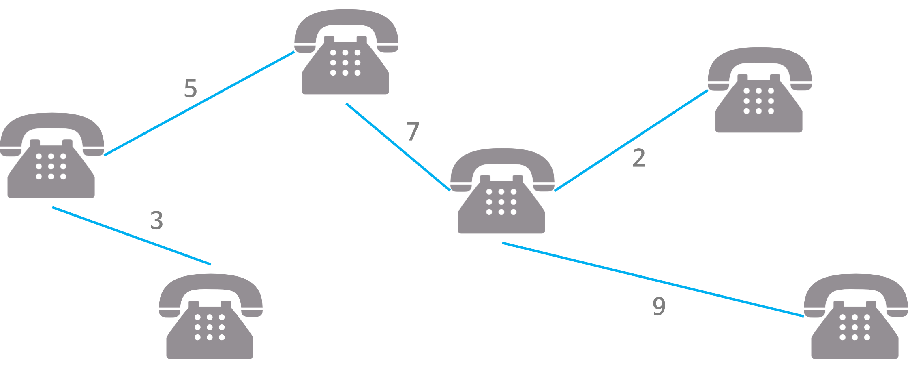

# Spanning Tree

## 정의
- 그래프의 최소 연결 부분 그래프
- 최소 연결 = 최소 간선의 수
- n개의 정점을 가지는 그래프의 최소 간선의 수는 n-1개이고, n-1개의 간선으로 연결되어 있으면 필연적으로 트리 형태가 된다.
- **그래프에서 일부 간선을 선택해서 만든 트리**

## 특징
1. DFS, BFS을 이용하여 그래프에서 신장 트리를 찾을 수 있다.
    - 탐색 도중에 사용된 간선만 모은다.

2. 하나의 그르패에는 많은 신장 트리가 존재할 수 있다.
3. Spanning Tree는 트리의 특수한 형태
    - 모든 정점들이 연결되어 있어야 한다.
    - 사이클을 포함하지 않는다.
4. n개의 정점을 n-1개의 간선으로 연결한다.

## 사용 예시

### 통신 네트워크 구축

- 회사 내의 모든 전화기를 가장 적은 수의 케이블을 사용하여 연결하고자 하는 경우
- n개의 위치를 연결하는 통신 네트워크를 최소의 링크를 이용하여 구축하고자 하는 경우, 최소 링크의 수는 n-1개가 되고, 따라서 Spanning Tree가 가능해진다.

---

# MST(Minimum Spanning Tree)

## 정의
### 최소 신장 트리
: Spanning Tree 중에서 사용된 간선들의 가중치 합이 최소인 트리

- 각 간선의 가중치가 동일하지 않을 때 단순히 가장 적은 간선을 사용한다고 해서 최소 비용이 얻어지는 것이 아닌, 간선에 가중치를 고려하여 최소 비용을 선택하는 것이다.
- **네트워크에 있는 모든 정점들을 가장 적은수의 간선과 비용으로 연결하는 것**

*네트워크 : 가중치를 간선에 할당한 그래프

## 특징
1. 간선의 가중치의 합이 최소여야 한다.
2. n개의 정점을 가지는 그래프에 대해 반드시 (n-1)개의 간선만을 사용해야 한다.
3. 사이클이 포함되어서는 안된다.

## 사용 예시

### 통신망, 도로망, 유통망에서 길이, 구축 비용, 전송 시간을 최소로 구축하는 경우

1. 도로 건설
    - 도시들을 모두 연결하면서 도로의 길이가 최소가 되도록 하는 문제
2. 전기 회로
    - 단자들을 모두 연결하면서 전선의 길이가 최소가 되도록 하는 문제
3. 통신
    - 전화선의 길이가 최소가 되도록 전화 케이블 망을 구성하는 문제 

---

# MST 구현 방법

## Kruskal MST 알고리즘
네트워크의 모든 정점을 최소 비용으로 연결하는 방법

## Prim MST 알고리즘
시작 정점에서부터 출발하여 신장트리 집합을 단계적으로 확장하는 방법