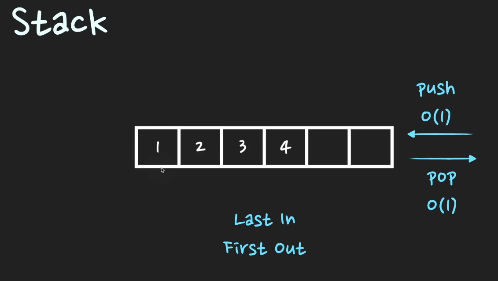
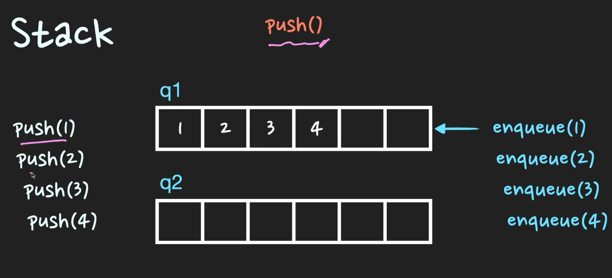
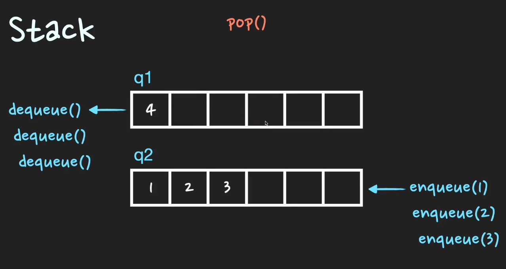

# 스택 (Stack)

> 후입선출(LIFO) 자료구조

> push -> O(1), pop -> O(1)

### 활용되는 사례
- 브라우저 방문기록 (뒤로가기)
- DFS 깊이우선 탐색

### Queue 2개이용해서 Stack 구현하기

- `push` 구현하기
  - enqueue 실행
  - O(1)

- `pop` 구현하기
  - q1 큐에 하나가 남을때까지 dequeue 실행
  - q1 하나남은 요소 dequeue 실행
  - 다음 작업 위해 q1, q2 변경해주기
  - O(n-1) ---> O(n)

