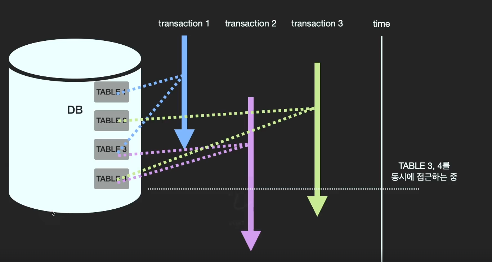

## Transaction

- Database에서 수행되는 작업의 최소단위
  - ex) 계좌에서 부터 돈이 출금되고 원하는 계좌에 돈이 입급되는 하나의 작업

- Database `무결성`을 유지하며 상태를 업데이트하는 기능

- Transaction은 `ACID`규칙을 따른다.

### ACID
#### Atomicity
transaction에 포함된 작업은 모두 수행되거나 또는 모두 수행되지 않아야 한다.

#### Consistency
transaction전후 언제나 데이터가 일치하여야 한다. 데이터 타입 / 데이터의 총합 등등

#### Isolation
각각의 transition들이 동시에 병행하여 수행이 가능한데 서로의 데이터에 영향을 주어서는 안된다.

#### Durability
transaction이 끝난 후, 데이터는 유지가 되어야 한다.

### 동시성 제어
transaction작업은 여러개가 동시에 병행적으로 가능하다. 그러다보니 하나의 Data가 동시에 Update되는 경우가 발생하고 특정 transaction의 작업이 갱신 무효화가 발생할 수 있다. `갱신 손실`

transaction에 의해 작업이 시작이 되면 해당 table은 `Locking`상태가 되고 커밋이 이루어질때까지 그 상태가 유지가 된다. `Lock`상태가 되면 다른 transaction에서는 해당 table을 접근할때 기다려야 한다. DBMS의 기본 기능중에 하나이다.

#### 용어정리
- Commit: transaction 작업완료 후  작업을 확정 짓는 명령어
- Rollback: transaction에 문제가 발생하여 해당 작업 전체를 이전 커밋 상태로 되돌리는 행위