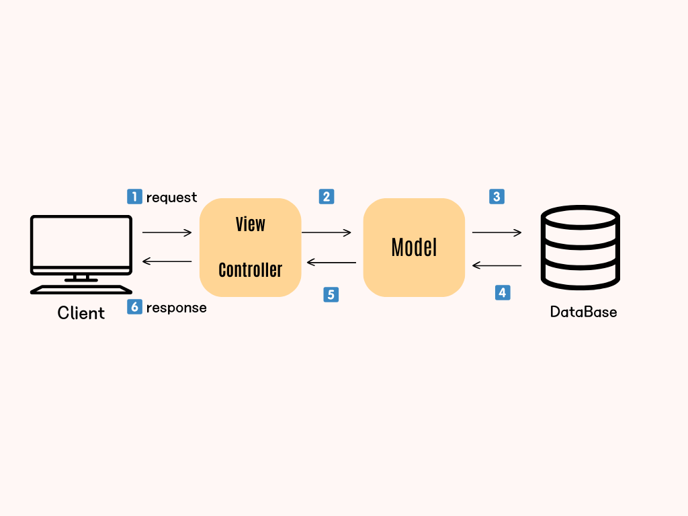

## MVC 패턴이란?

> 하나의 프로젝트를 구성할 때, **Model**, **View**, **Controller** 세가지 역할로 나누어서 개발하는 디자인패턴 방법론

### Model

- 어플리케이션이 **무엇**을 할지 정의한다.
  - 연결된 데이터 베이스 테이블에 대응됨

### View

- Controller로 부터 응답받은 데이터를 사용자 화면에 보여주는 역할

### Controller

- 사용자 요청에 맞춰 데이터를 Model에 요청
- 응답받은 데이터를 View에 전달

## MVC패턴을 사용하는 이유는?

각각의 역할을 부여하여 분리할 수 있다. 이는 유지보수, 확장성, 유연성이 증가하여 협업하기 유리하다.

## Model1 ? Model2

MVC패턴에는 `Model1`방식과 `Model2` 방식이 있다.

### Model1

- Controllerr과 View를 같이 구현하는 방식

View에서 요청을받고 작업의 결과를 출력한다.

👍 **장점**

- 빠르고 쉽게 개발이 가능하다

👎 **단점**

- View파일 자체가 너무 커지는 경향, 유지보수에 어렵다.

### Model2

- Controller과 View 영역을 분리하는 방식
- 비지니스 로직영역과 프레젠테이션 영역 분리

Controller에서 클라이언트로 부터 받은 요청을 **View**로 보여줄지 **Model**로 보내줄지 정한다.

👍 **장점**

- 유지보수에 유리하며 협업이 쉽다

👎 **단점**

- 설계 단계에서 난이도가 증가한다.

cf) `Model1` 방식을 채택하는 웹 서비스는 거의 없다.

## 장점과 단점

### 장점

- 유연하고 확장하기가 쉽다.
- 구분하기 때문에 동시 다발적인 개발이 가능하다.

### 단점
