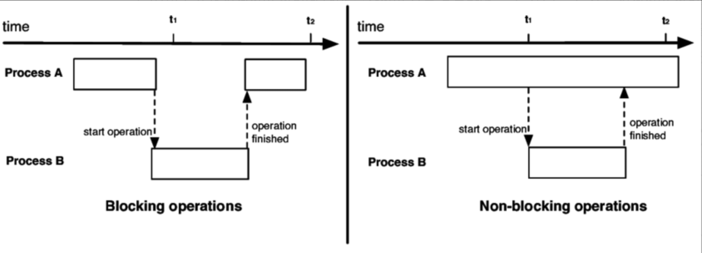
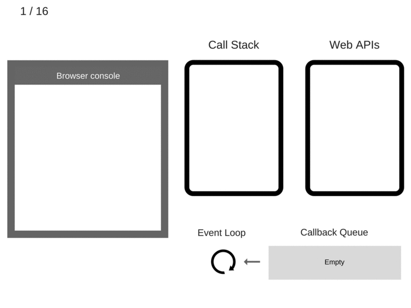

# Event Loop의 작동 방식

### JavaScript 런타임
- 런타임 = 프로그래밍 언어가 구동되는 환경
- JavaScript 런타임 종류 : 웹 브라우저, Node.js

<br/>

### 웹 브라우저 내 JavaScript 런타임

> #### 1. JS는 싱글 스레드
- JavaScript V8엔진 소스 내부: 하나의 힙, 하나의 콜 스택만 존재.
    - 메모리 힙: 변수, 객체의 메모리 할당에 사용되는 비정형 메모리
    - 콜 스택: 호출된 함수가 순서대로 실행될 수 있도록 함수의 실행 순서를 기억하는 스택 구조
- 한 번에 하나의 일만 처리하는 '동기적' 특성을 지닌다.

> #### 2. 싱글 스레드는 블로킹을 유발한다.
- 블로킹(Blocking) : 다른 요청의 작업을 처리하기 위해 현재 작업을 block(차단)함  
    → 특정 작업이 전체적인 작업 흐름을 막는 것
    <div align="center">
    </div>
    <br/>
- 예) if "동기적으로" AJAX 요청 → 모든 응답이 완료될 때까지 브라우저 작업이 중단됨  
    (동기적으로 실행되는 네트워크 요청이 콜 스택을 블로킹)  
<br/>

> #### 3. JS의 싱글 스레드 환경에서 ⭐️Non-Blocking 방식으로 작동하게 하려면?⭐️
- <u>**웹 브라우저 Web APIs**</u> 이용: 비동기로 처리
- setTimeout, DOM, AJAX(HTTP Request) ...
- Event Loop, Callback Queue
    #### → JS 런타임 안에서 지원하는 별도의 API(Web API)를 이용해 비동기 처리가 가능하게 하는 것.

<div align="center">

</div>

<br/>

- Callback Queue : 콜백 함수가 Queue 형태로 쌓임 (FIFO)
    - 콜백 함수 : 다른 함수에게 인자로 전달된 함수
- Event Loop (🔁): Call Stack과 Callback Queue를 모니터링
    - 콜 스택이 빌 때까지 기다리다가 콜백 큐에 쌓인 첫 번째 콜백 함수를 콜 스택에 push한다.
    - 이러한 반복을 '틱(tick)'이라고 한다.

<br/>

### 코드 예시로 보는 Event Loop 동작 과정

```
    console.log('Hi');
    setTimeout(function cb1() {
        console.log('cb1');
    }, 5000);
    console.log('Bye');
```


1. `console.log('Hi')` → 콜 스택에 추가
2. `console.log('Hi')` 실행
3. `console.log('Hi')` → 콜 스택에서 제거
4. `setTimeout(cb1(), 5000)` → 콜 스택에 추가
5. `setTimeout(cb1(), 5000)` 실행
    - 브라우저 : Web API의 일부로 타이머 생성, 카운트다운 처리
6. `setTimeout(cb1(), 5000)` → 콜 스택에서 제거
7. `console.log('Bye')` → 콜 스택에 추가
8. `console.log('Bye')` 실행
9. `console.log('Bye')` → 콜 스택에서 제거
10. 5000ms 후: 타이머 완료, `cb1` 콜백 함수를 Callback Queue로 push
11. Event Loop: Call Stack이 비어있음을 감지, Callback Queue에서 Call Stack으로 `cb1` 푸쉬
12. `cb1` 실행, `console.log('cb1')` → 콜 스택에 추가
13. `console.log('cb1')` 실행
14. `console.log('cb1')` → 콜 스택에서 제거
15. `cb1` → 콜 스택에서 제거