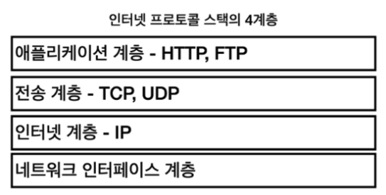
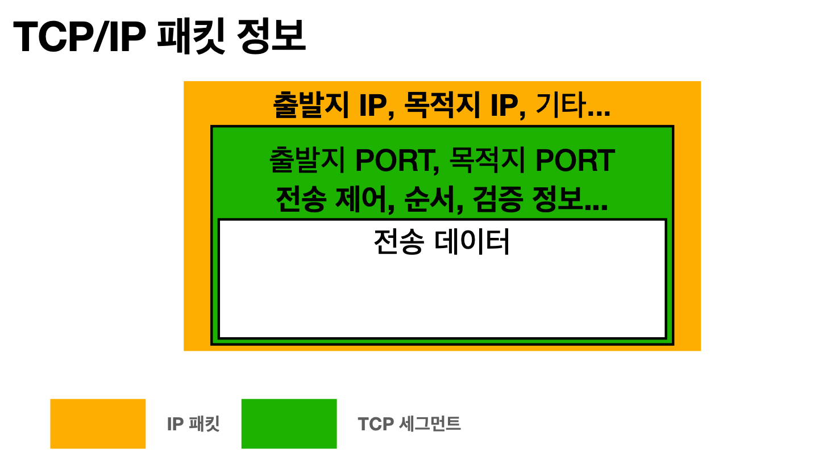
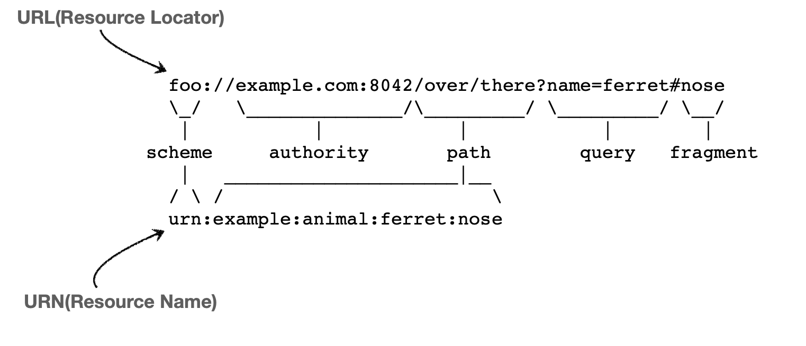
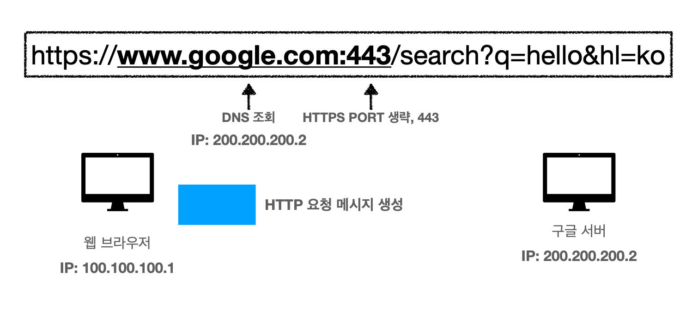
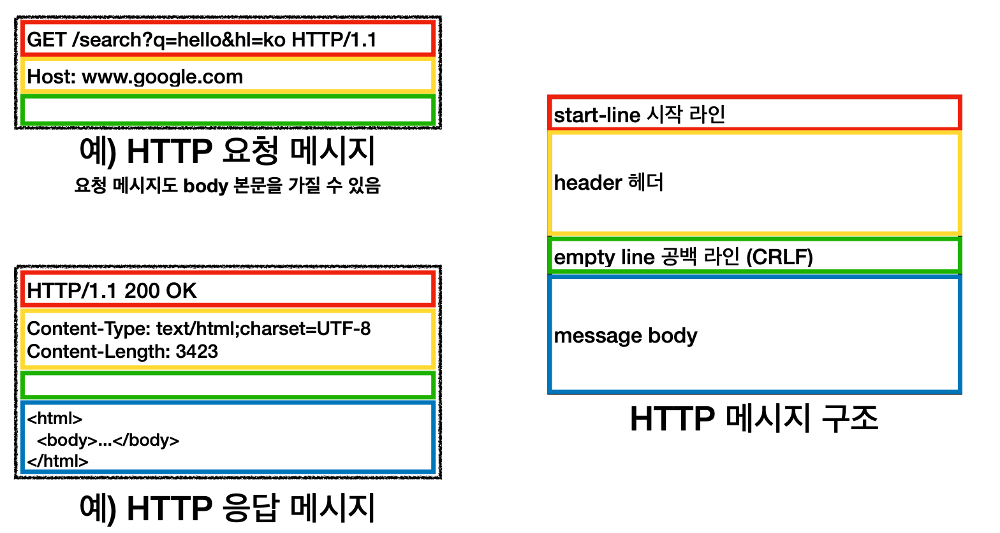

# HTTP
#### 클라이언와 서버를 분리하는 이유
- 클라이언트에서 DB를 직접 핸들링하면 보안상의 위험
- 클라이언트(UI 화면로직) 서버(비즈니스 로직) 각각의 역할을 구분하여 확장이 용이

`Client` <=> `Internet` <=> `Sever`




## IP
#### IP 패킷 정보
- 출발, 도착 IP, 기타
- 전송 데이터
  
#### IP의 한계 
- 비연결성: 패킷을 받을 대상이 없거나 서비스 불능 상태에도 패킷이 전송이 된다.
- 비신뢰성: 중간에 패킷이 손실되거나 패킷의 순서가 보장되지 않는다.
- 프로그램 구분: 하나의 IP에서도 여러개의 App이 실행중일때 구분이 되지 않는다.
  
## TCP / UDP
- IP패킷을 보완해주는 구조
### TCP
- 대부분이 TCP를 사용하지만 Http 3.0부터는 UDP를 사용하는 추세
  


- 연결지향성 : `3 way handshake`
- 데이터 전달보증 및 순서보장
- 구분을 위한 포트번호 생성

### UDP
- 기능이 거의 없어서 커스텀하기 편리하다.
- 단순하고 빠르다.
- IP와거의 동일하지만 포트번호만 구분한다.

### DNS
- IP주소를 일일이 기억하기 어렵고 IP주소는 얼마든지 바뀔 수 있다.
- DNS 서버를 통해서 따로 IP에 해당하는 도메인 이름을 관리하는 시스템
- 네트워크 요청시 입력하는 uri를 DNS서버 통해 해당하는 ip주소를 가져오는 형식이다.

## 웹 브라우저 요청 흐름

### URI ? URL ? URN ?


## 요청의 흐름

```요청메시지
GET /search?q=hello&hl=ko HTTP/1.1
Host: www.google.com
```
- 패킷 구성
  - 출발도착: IP(Port)
  - HTTP 메시지
  - 전송데이터(일반적으로 Get일때는 보내지 않는다)

## HTTP
> 웬만한 데이터 형태를 주고 받을 수 있다.
> HTTP/1.1 사용
> HTTP/2 성능개선버전, HTTP/3 TCP대신 UDP사용

### 클라이언트 서버구조
- Request, Response 구조

### Stateless
- 서버가 클라이언트의 상태를 보존하지 않음
- 서버의 수평적 확장성이 높음 (중간에 특정 서버가 장애가 날경우 다른 서버로 대응이 가능)
- But, 클라이언트가 전송해야할 데이터양이 많아진다
- But, 실무의 한계 로그인한 사용자의 경우 로그인 했다는 상태를 서버에 유지해야함
  - 브라우저의 쿠키, 서버의 세션을 이용해서 상태유지
  - 상태 유지는 최소화해야한다.

### Connectionless
- 클라이언트와 서버는 통신의 행위가 끝나면 연결상태가 끊긴다.
- 즉, 동시에 여러클라이언트로부터 대응이 가능하다.
- But, 새로운 열결마다 3 way handshake시간 추가
- BUt, 여러 자원을 연속해서 받아올 경우 `지속연결`로 문제해결이 가능하다.


## HTTP 메시지 구조
