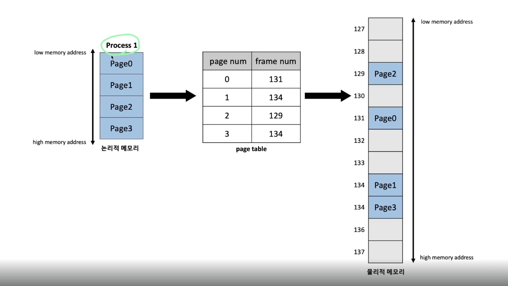
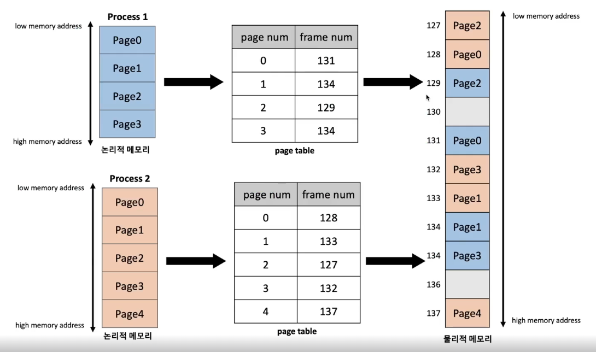
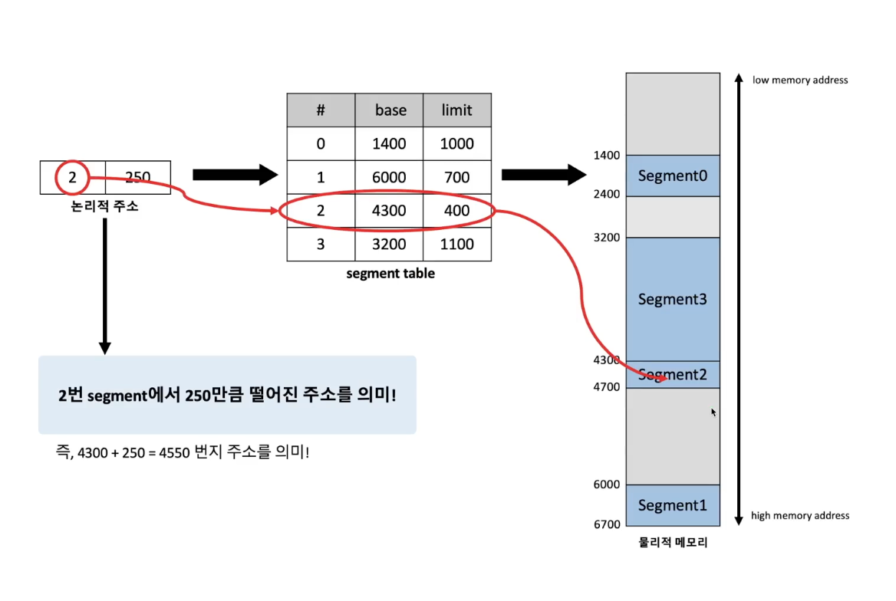
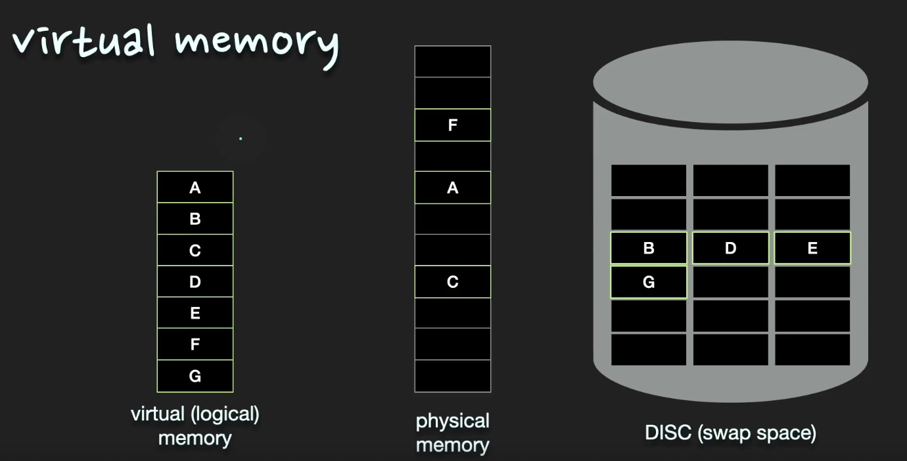

# 운영체게 관련 질문모음

### 개념설명

- 프로세스의 `논리적 주소`
  - 각각의 프로세스마다 독립적으로 할당
  - 각각의 주소는 0번지부터 할당
- 프로세스의 `물리적 주소`
  - 프로세스가 실제 메모리에 적재되는 위치

- 주소바인딩(Address Binding)
  - CPU가 명령을 수행할 수 있게 논리적 주소를 물리적 주소에 어디에 매핑되는지 확인하는 작업

## 프로세스 페이징 기법
프로세스가 할당받은 일정한 메모리 공간을 일정한 `Page`로 나누어 물리적 메모리에 `연속되지 않게` 서로다른 위치에 저장하는 메모리 관리 기법

- 동일한 크기로 페이지를 나눈다.
- 물리적 메모리에 저장된 위치를 쉽게 파악하기 위해 `page table`이 생성된다.
  - 주소바인딩을 수월하게 하기위해
- 메모리 단편화
  - `내부 단편화` 문제가 발생할 수 있다.
  - 프로세스를 일정한 크기로 나누면서 비효율적으로 나누어 질 수 있기때문에

## 프로세스 세그먼트 기법

프로세스가 할당받은 메모리공간을 세그먼트 즉, `의미단위`로 나눈뒤 물리적 메모리에 연속되지 않은 위치에 할당하는 메모리 관리 기법

여기서 의미단위는 `code`, `data`, `stack`, `heap`등이 해당한다.

- 주소바인딩을 위해 `segment table`이 생성된다.
- paging 기법과 다르게 크기가 정해져 있지 않기때문에 크기를 명시해둔다.
- 외부단편화 가능성이 있다.

## ⭐️가상 메모리
프로세스전체가 메모리에 올라오지 않더라고 실행이 가능하도록 하는 기법

실제프로그램이 물리적 메모리보다 커져도 실행이 가능한 이유

- 개발자가 실제 개발을 할때 물리적인 메모리에 대한 걱정없이 논리적인 메모리만을 고려하여 개발이 가능하다.
- 운영체제에서 논리적영역에서 당장 필요한 부분만 `물리적 메모리 공간`에 할당
- 직접적으로 필요하지 않는 부분은 Disk `Swap 영역`에 저장한다.

### 페이지 교체 알고리즘
- 메모리 공간이 부족해서 현재 물리적 메모리에 올려져 있는 페이지를 교체
- 가장 필요없는 페이지를 교체함에 있어서 필요한 알고리즘

1) FIFO

2) 최적페이지 구현 - 가장 안쓰는 페이지교체 (구현 가능성 낮음)

3) LRU - 가장오랫동안 사용되지 않은 페이지 교체

4) LFU - 가장 참조가 적은 페이지 교체