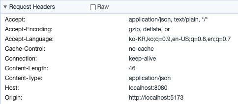
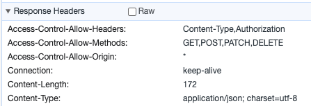

# CORS (Cross-Origin Resource Sharing)

### 정의

    "교차 출처 리소스 공유"
    한 출처에서 실행 중인 웹 애플리케이션이
    다른 출처의 선택 자원에 접근할 수 있는 권한을 부여하는 체제

- 출처(Origin)의 의미  
   `Protocol` + `Host` + `Port` (즉, Base URL)


<br/>
<br/>

### 동일 출처 정책 (Same-Origin Policy)

- 동일한 출처에서만 리소스를 공유할 수 있다는 정책
- 다른 출처(Cross-Origin) 서버에 있는 리소스는 상호작용 불가능
- `동일 출처` = 동일한 프로토콜, 호스트, 포트(명시된 경우)를 갖는 URL
  - 세 가지 중 하나라도 자신의 출처와 다를 경우, 브라우저 정책상 이를 차단한다.
- 효과

  - 잠재적 악성 문서 격리 → CSRF, XSS 등의 공격 방지

  ### 대표적 예시 :

  > 1. XMLHttpRequest, Fetch API
  >
  >    - 다른 도메인 소스에 대해 Javascript ajax 요청 API 호출 시
  >    - 자바스크립트 내에서의 요청은 기본적으로 보안상 교차 출처에 대한 요청을 제한한다.
  >
  > 2. 웹 폰트(CSS 내 `@font-face`에서 교차 도메인 폰트 사용 시) : 일부 브라우저는 교차 출처 허용하는 경우 있음.  
  >    <br/>
  >    => 기본적으로는 동일 출처 정책이 적용되므로, 상호작용이 필요한 경우 CORS를 사용해 사이트간 HTTP 요청을 허용시킨다.

<br/>

### 교차 출처 네트워크 접근이 가능한 경우

- 교차 출처 간 상호작용의 종류

  - 교차 출처 쓰기: 링크, 리다이렉트, 양식(form) 제출 등
  - 교차 출처 삽입: 하단에 리소스 예시들
  - 교차 출처 읽기: <u>보통 허용하지 않음.</u> 그러나, 교차 출처 삽입 과정에서 종종 읽기 권한이 누출된다.

- 교차 출처 삽입 가능한 리소스 예시
  - ``, `<video>`, `<script>`, `<link>`, `<iframe>` 태그 등
  - 위 태그의 href, src 속성 → 다른 사이트의 리소스에 접근 가능

<br/>
<br/>

### 출처 구분 및 교차 출처 차단의 주체 = '브라우저'

- 요청 출처를 비교하는 로직은 브라우저에 구현된 스펙이다.
- 서버가 리소스 요청에 대한 응답을 했더라도, 브라우저가 분석한 결과 동일 출처가 아니라면 에러를 발생시키는 것.  
  <br/>
  <br/>

### CORS의 기본 동작

1. **클라이언트 : HTTP 요청 헤더에 Origin을 담아 전송**  
   
   - `Origin` : 요청이 시작된 서버 URI  
     <br/>
2. **서버 : 응답 헤더에 Access-Control-Allow-Origin 담아 전송**  

   
   - `Access-Controll-Allow-Origin` : `<Origin>` || `*`
   - `*` (와일드카드) : 브라우저의 Origin에 상관 없이 모든 리소스에 접근하도록 허용함  
     <br/>
3. 응답을 받은 브라우저는 `Origin`과 `Access-Control-Allow-Origin`을 비교  
    - 동일한 경우 : 유효한 요청으로 판단, 정상적으로 리소스를 가져옴  
    - 동일하지 않음 (유효하지 않은 요청) : CORS 에러 발생, 응답을 폐기한다.  
<br/>
<br/>
<br/>

### CORS 작동 방식 시나리오 (3가지)

1. **예비 요청 (Preflight Request)**
- 브라우저가 요청을 보낼 때 바로 보내는 것이 아닌, '예비 요청'을 먼저 보낸 후 통신의 안전성을 확인한 다음 본 요청을 보내는 방식  
- 예비 요청 = Preflight  
- 사용되는 HTTP 메소드명 : `OPTIONS` (HTTP 1.1 메소드)  
    ``` 
     //예비 요청 예시

     OPTIONS /path HTTP/1.1
     Origin: https://foo.example
     Access-Control-Request-Method: POST
     Access-Control-Request-Headers: Content-Type
     ...
     ```

- 서버는 응답으로 해당 서버의 요청 허용 범위를 헤더에 담아 보냄
     ```       
     HTTP/1.1 200 OK
     Access-Control-Allow-Origin: https://foo.example
     Access-Control-Allow-Methods: POST, GET, OPTIONS ...
     Access-Control-Allow-Headers: Content Type
     Access-Control-Max-Age: 86400
     ``` 
- 브라우저는 요청과 서버의 응답에 담긴 정책을 비교 → 요청의 안전성을 확인한 후 실제 요청을 전송
    > 단점 : 실제 요청에 소요되는 시간이 늘어남  
    >  → 브라우저 캐시에 `Access-Control-Max-Age` 에 명시된 시간만큼 Preflight 요청을 캐싱시켜 최적화.  
 
<br/>
<br/>


2. **단순 요청 (Simple Request)**

- 예비 요청을 생략하고 서버에 바로 본 요청을 보낸 후,
- 서버의 응답 헤더 안에 있는 `Access-Control-Allow-Origin`을 비교하여 CORS 정책 위반 여부를 검사함
- 조건 (까다로움) :  
    - 요청 메소드 : GET, HEAD, POST  
    - `Accept`, `Accept-Language`, `Content-Language`, `Content-Type`, `DPR`, `Downlink`, `Save-Data`, `Viewport-Width`, `Width` 헤더일 경우에만 적용됨
    - Content-Type 헤더가 `aplication/x-www-form-urlencoded`, `multipart/form-data`, `text/plain` 중 하나여야 함  
    <br/>

    > => 대부분의 API 요청은 Preflight으로 이뤄진다고 이해해도 무방

<br/>
<br/>

3. **인증된 요청 (Credentialed Request)**

- 클라이언트에서 **자격 인증 정보(Credential)** 를 실어 요청할 때 사용하는 방식
- 자격 인증 정보 : 쿠키의 Session ID, Authorization 헤더에 설정된 토큰값 ...

  > 1. 클라이언트에서 credentials 옵션을 통해 요청 데이터에 인증 관련 정보를 담는다.
  > 2. 서버에서 인증된 요청에 대해 헤더를 설정한다.
  >    - `Access-Control-Allow-Origin` 헤더를 분명한 Origin으로 설정 (와일드카드 X)
  >    - `Access-Control-Allow-Credentials` : true

<br/>
<br/>
<br/>

### CORS 에러 해결 방법

    1. 서버 단
        - `Access-Control-Allow-Origin` 응답 헤더 설정
        - 미들웨어로 CORS 컨트롤

    2. 클라이언트 단
        - Chrome 확장프로그램 : 'Allow CORS: Access-Control-Allow-Origin'
            - local환경에서 API 테스트 시 발생하는 CORS 문제 해결
        - Proxy 서버 설정
        - 무료 프록시 사이트 이용 → api 요청 횟수 제한 있음
        예) heroku 프록시 서버 : http://cors-anywhere.herokuapp.com/corsdemo

<br/>
<br/>
<br/>

---

### 참고

[mdn web docs - CORS](https://developer.mozilla.org/ko/docs/Web/HTTP/CORS)  
[mdn web docs - 동일 출처 정책](https://developer.mozilla.org/ko/docs/Web/Security/Same-origin_policy#%EA%B5%90%EC%B0%A8_%EC%B6%9C%EC%B2%98_%EB%84%A4%ED%8A%B8%EC%9B%8C%ED%81%AC_%EC%A0%91%EA%B7%BC)  
[INPA blog - 악명 높은 CORS 개념 & 해결법](https://inpa.tistory.com/entry/WEB-%F0%9F%93%9A-CORS-%F0%9F%92%AF-%EC%A0%95%EB%A6%AC-%ED%95%B4%EA%B2%B0-%EB%B0%A9%EB%B2%95-%F0%9F%91%8F)
