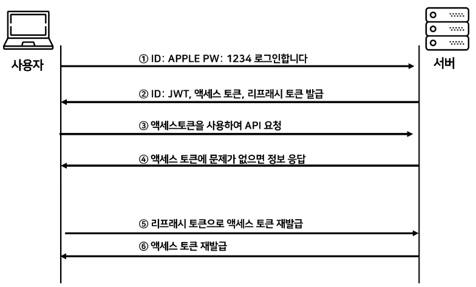

# 토큰 인증과 JWT (FE 관점에서)

## 쿠키 vs 세션

|                                             | 쿠키                                                    | 세션                           |
| ------------------------------------------- | ------------------------------------------------------- | ------------------------------ |
| 정보 저장 위치                              | 클라이언트                                              | 서버                           |
| 저장 형식                                   | Text                                                    | Object                         |
| 보안성                                      | 취약                                                    | 상대적으로 좋음                |
| 요청 처리 속도                              | 요청 시 필요한 값을 그대로 담아 보내기 때문에 빠름      |
| (단, 쿠키의 사이즈가 커지면 네트워크 부하↑) | 서버에서 세션값을 식별하는 절차로 인해 쿠키에 비해 느림 |
| 만료 시점                                   | 쿠키 저장시 설정 (없을 시 브라우저 종료 시)             | 정확한 시점 알 수 없음         |
| 서버 리소스                                 | -                                                       | 세션이 생길 때마다 리소스 차지 |
| 용량 제한                                   | 도메인당 20개, 쿠키 하나 당 4KB                         | 없음                           |

### 쿠키 단점

- 보안에 취약
  - 클라이언트 측에 사용자 정보 저장 → JS, 브라우저 상에서 쿠키 조작 가능
  - 쿠키 탈취

### session 단점

- 세션이 늘어날수록 서버 부담 증가
- 매 요청마다 서버에서 DB접근, 조회해야 함

<br/>
<br/>

## 👉 Token 기반 인증 방식


- 서버가 클라이언트에게 인증되었다는 의미의 유일한 토큰을 부여
- 클라이언트 요청시 토큰을 요청 헤더에 심어 보내고, 서버는 토큰의 일치 여부를 체크하여 인증하는 방식
- 세션 방식과 달리 서버측 DB에서 클라이언트의 상태를 유지할 필요가 없어, Stateless한 특징을 갖는다.  
  <br/>
  <br/>
  <br/>

---

## JWT (JSON Web Token)

= 인증에 필요한 정보들을 암호화시킨 JSON 토큰

### 구조

- **Header**

  ```jsx
  {
  	"alg": "HS256",
  	"typ": "JWT",
  }
  ```

  - 토큰 유형 지정
  - 서명 암호화를 위한 해시 알고리즘 명시

- **Payload**

  ```jsx
  {
  	"jti": "1000",
  	"exp": "1521430000000",
  	"username": "John Doe"
  	...
  }
  ```

  - 서버에서 첨부한 **사용자 권한 정보 및 사용자 데이터**
    = 실제로 사용될 정보에 대한 내용을 담고 있다.
  - key-value 쌍의 정보 단위를 **Claim**이라고 지칭한다.
  - Claim 종류
    - Registed claims : 미리 정의된 클레임
    - Public claims : 사용자가 정의할 수 있는 클레임. 공개용 정보 전달을 위해 사용함
    - Private claims : 당사자들 간 정보 공유를 위한 사용자 지정 클레임. 해당 유저를 특정할 수 있는 정보들을 담는다.

- **Signature**
  - Header와 Payload를 encode한 후 Header에 명시해둔 해시 함수를 적용, 개인키(private key)로 서명한 전자서명

<br/>
<br/>

### JWT 인증 과정



1. 사용자 로그인
2. 서버에서 암호화된 토큰(access, refresh) 생성 후 클라이언트 전달
3. 클라이언트측 - 토큰 저장 (쿠키, 스토리지 …)
4. 이후 모든 요청시 Authorization header에 Access Token을 포함시킨다.
5. 서버는 토큰 일치 여부를 확인하여 사용자를 식별한다.
6. Access Token이 만료된 경우, 클라이언트에서 Refresh Token을 이용해 서버로부터 새로운 Access token을 요청한다.  
   <br/>

### 장점

- 인증 정보에 대한 별도의 저장소가 필요 없어 **DB조회에 대한 서버의 부담 완화**  
  ⇒ 이로써 서버는 무상태(Stateless)가 되어 서버 확장성이 우수해질 수 있다  
  cf) Session - 서버에서 유저 인증 상태 정보를 저장
- Signature를 통해 **데이터 위변조**를 막을 수 있다.
- 인증에 필요한 **모든 정보를 자체적으로 지니고** 있다.  
  - 토큰에 사용자별 권한 설정 가능 → 개인화된 토큰 발행  
- **모바일** 어플리케이션 환경에서 활용 가능하다. (모바일- 세션 사용 불가능)  
  <br/>

### 단점

- 토큰 자체에 모든 정보를 담고 있음 → 양날의 검
- 토큰 길이 : 토큰의 payload에 담긴 claim 정보가 많아질수록 토큰 길이가 늘어나 **네트워크 부하 발생** 가능
- **Payload 자체는 암호화 된 것이 아니다**
  - BASE64로 인코딩된 것이기 때문에 중간에 payload를 탈취, 디코딩한다면 데이터를 조회 가능  
    → 중요 데이터는 포함시키지 않아야!
- **클라이언트측 저장 방식의 한계**로 인한 보안 문제  
  - stateless 특징으로 토큰은 클라이언트 측에서 관리, 저장되지만  
  - 이 특성 때문에 토큰이 탈취당할 경우 대처가 어렵다.  
    ⇒ Access, Refresh 이중 인증 방식  
  <br/>

### Access Token, Refresh Token

| Access token                            | Refresh token              |
| --------------------------------------- | -------------------------- |
| 사용자 정보에 접근하기 위한 인증용 토큰 | 만료된 Access Token 갱신용 |
| 유효기간 짧음                           | 유효기간 긺                |
| 모두 : 로그아웃, 세션 종료 시 만료      |

- Access Token 단일 인증 방식의 문제점

  - JWT는 발급 후 삭제 불가능  
  → 토큰을 제3자에게 탈취당할 경우 보안에 취약

  **⇒ Access token에 짧은 유효시간을 부여, 이를 재발급할 수 있는 Refresh Token을 추가로 발급함**

- 원리  
  - 서버는 Refresh Token만, 클라이언트는 Refresh, Access token 모두 저장  
  - 사용자가 인증이 요구되는 API에 접근하면, 토큰 유효성을 검사한다.  
  - access, refresh 모두 만료 : 재로그인  
  - access만 만료 : refresh token을 검증해 access token 재발급  
  - refresh만 만료 : access token을 검증해 refresh token 재발급  
  - 모두 유효 : 정상 처리  

  <br/>
  <br/>
  <br/>

---

## Frontend에서 JWT 다루기

### 👾 클라이언트 측 토큰 저장 위치

### 1. 로컬스토리지 / 세션스토리지 (Web storage)

- 로그인 성공 시 전달된 토큰을 웹브라우저 스토리지에 저장
- 서버 요청을 보낼 때 자바스크립트로 꺼내서 보내는 방식
- 문제점
  - XSS(Cross Site Scripting) 공격에 취약함
  - 토큰 값을 탈취당할 가능성

### 2. 쿠키 (HTTP Only, Secure)

- 쿠키 역시 자바스크립트로 접근 가능 ⇒ HTTP Only, Secure 옵션으로 방지
- 문제점  
  - 토큰값 자체의 탈취는 거의 막을 수 있으나, CSRF(Cross-Site Request Forgery) 공격에 취약  
- 보완 방법 : RTR(Refresh Token Rotation) 도입  
  → Refresh token을 일회용으로 만들어 탈취된 토큰이 무한정 사용되는 것을 막아줌  
  <br/>
  <br/>

### 👾 Access Token과 Refresh Token을 어디에 저장해야 하는가

구현 방식에 정답이 있는 것은 아니지만, 조사 결과 최대한 보안을 유지할 수 있는 방식을 정리했습니다.

| Access Token        | Refresh Token               |
| ------------------- | --------------------------- |
| private 변수로 저장 | HTTP Only, Secure 쿠키 저장 |

⇒ Refresh Token은 서버에 저장, 관리

⇒ Access Token 만료 시 Refresh Token으로 재발급 요청

⇒ 새로고침 시 Access Token을 저장한 변수가 사라지게 되므로, 새로고침 시 Refresh Token을 통해 토큰을 재발급하는 로직 구현  
<br/>
<br/>

---

### 참고

[https://inpa.tistory.com/entry/WEB-📚-JWTjson-web-token-란-💯-정리](https://inpa.tistory.com/entry/WEB-%F0%9F%93%9A-JWTjson-web-token-%EB%9E%80-%F0%9F%92%AF-%EC%A0%95%EB%A6%AC)

[https://inpa.tistory.com/entry/WEB-📚-Access-Token-Refresh-Token-원리-feat-JWT](https://inpa.tistory.com/entry/WEB-%F0%9F%93%9A-Access-Token-Refresh-Token-%EC%9B%90%EB%A6%AC-feat-JWT)

[https://velog.io/@ohzzi/Access-Token과-Refresh-Token을-어디에-저장해야-할까#정리](https://velog.io/@ohzzi/Access-Token%EA%B3%BC-Refresh-Token%EC%9D%84-%EC%96%B4%EB%94%94%EC%97%90-%EC%A0%80%EC%9E%A5%ED%95%B4%EC%95%BC-%ED%95%A0%EA%B9%8C#%EC%A0%95%EB%A6%AC)

[https://velog.io/@badahertz52/프론트-엔드에서-JWT-AccessToken-RefreshToken-다루기#a-accesstoken](https://velog.io/@badahertz52/%ED%94%84%EB%A1%A0%ED%8A%B8-%EC%97%94%EB%93%9C%EC%97%90%EC%84%9C-JWT-AccessToken-RefreshToken-%EB%8B%A4%EB%A3%A8%EA%B8%B0#a-accesstoken)
