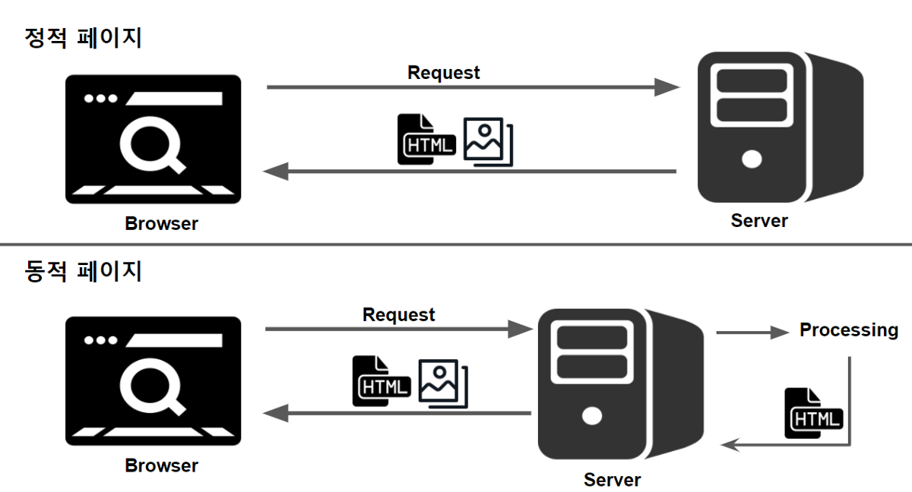

# 🛜 Web Server 와 WAS

---

# 1. 기본 개념
### * 클라이언트 (Client)

- #### 서비스나 리소스를 요청하는 컴퓨터나 소프트웨어를 의미. 웹 브라우징을 할 때 사용하는 브라우저(예: Chrome, Firefox)는 웹 서버에 페이지를 요청하는 클라이언트 역할
- #### 기능
  - 용자 인터페이스 제공
  - 사용자의 요청을 서버에 전송,
  - 서버로부터 받은 데이터나 리소스를 사용자에게 표시

### * 서버 (Server)
- #### 클라이언트의 요청에 따라 데이터나 리소스를 제공하는 컴퓨터나 소프트웨어를 의미
- #### 기능
  - 클라이언트의 요청 처리
  - 필요한 데이터나 리소스 제공
  - 다수의 클라이언트 요청 관리

### * 클라이언트-서버 상호 작용

클라이언트는 서버에 특정 정보나 서비스를 요청하고, 서버는 해당 요청에 대한 응답을 클라이언트에게 전송한다. 이러한 요청-응답 메커니즘이 클라이언트-서버 모델의 기본 구조다.

### * 정적 컨텐츠 (Static Content)
#### 서버에 저장된 그대로의 형태로 전달되며, 사용자의 요청이나 입력에 따라 그 내용이 변경되지 않는 데이터나 파일을 의미
    HTML, CSS, JavaScript 파일 같이 컴퓨터에 저장된 파일 등
- 특징
  -   사용자마다 다르게 표시되지 않는다.
  -   웹 서버만으로 처리 가능하다.

### * 동적 컨텐츠 (Dynamic Content)
#### 사용자의 요청, 입력, 서버의 로직에 따라 실시간으로 생성되거나 변경되는 컨텐츠를 의미
    뉴스 웹사이트의 기사 목록, 온라인 쇼핑몰의 재고 정보, 사용자 프로필 페이지 등
- 특징
  - 사용자의 요청이나 상황에 따라 내용이 바뀐다.
  - 데이터베이스와의 연동이 필요할 수 있다.

  

---
  

### 클라이언트의 요청 - 웹 서버 처리 - WAS 처리 - 응답 - 클라이언트의 출력
  

# 2. Web Server
#### 웹 서버는 클라이언트로부터 HTTP 요청을 받아 정적 컨텐츠(HTML, CSS, 이미지, 자바스크립트 파일 등)를 반환하는 서버
- 기능
    - 정적 컨텐츠 제공
    - HTTP 프로토콜을 기반으로 클라이언트의 요청에 대해 응답
- 대표적인 웹 서버 소프트웨어
    - Apach, Nginx, Microsoft's IIS

# 3. Web Application Server (WAS)
#### WAS는 동적 컨텐츠를 처리하기 위해 필요한 비즈니스 로직을 실행하는 서버.  
#### 데이터베이스와의 통신, 복잡한 계산 등을 처리하며, 그 결과를 웹 서버를 통해 클라이언트에게 전달.
- 기능
    - 동적 컨텐츠 처리 및 제공
    - 비즈니스 로직 수행
    - 데이터베이스 연결 및 데이터 처리
- 대표적인 WAS 소프트웨어
    - Tomcat, JBoss, WebSphere

# 4. Web Server vs WAS
### 4.1. 유사점
- 클라이언트-서버 모델: 둘 다 클라이언트-서버 모델을 기반으로 클라이언트의 요청을 처리하고 응답
- HTTP 프로토콜: 대부분의 웹 서버와 WAS는 HTTP 또는 HTTPS 프로토콜을 사용하여 통신

### 4.2. 차이점
- 컨텐츠 처리 방식: 웹 서버는 주로 정적 컨텐츠를 처리하며, WAS는 동적 컨텐츠를 처리
- 웹 서버는 파일 시스템에서 컨텐츠를 읽어 클라이언트에게 전달하는 것이 주 기능. 반면, WAS는 애플리케이션 로직을 실행하고 데이터베이스와 통신하는 등의 복잡한 작업을 수행
- 자원 사용량: 일반적으로 WAS는 웹 서버에 비해 더 많은 자원(CPU, 메모리 등)을 사용

### 4.3. 사용예시
- #### 웹 서버
  - 정적 웹사이트나 애플리케이션에서는 웹 서버만으로 충분 (빠르다)
  - 콘텐츠 전송 네트워크(CDN) 같은 환경에서는 주로 웹 서버가 사용  
  - 로드 밸런싱 및 리버스 프록시로 동작하는 경우에도 웹 서버를 사용

- #### WAS
  - 동적 컨텐츠를 처리해야 하는 웹 애플리케이션에서는 WAS가 필요 (비교적 느리다)
  - 사용자의 입력을 기반으로 데이터베이스에서 정보를 가져와서 페이지를 생성해야 하는 경우 WAS를 사용
  - 로그인, 쇼핑카트, 게시판 기능 등의 동적 기능이 포함된 사이트나 애플리케이션에서 WAS를 사용
  - 대부분의 현대 웹 애플리케이션 환경에서는 웹 서버와 WAS가 협업하여 서비스를 제공. 웹 서버는 정적 컨텐츠를 처리하고, 동적 컨텐츠 요청은 WAS로 전달하여 처리

# 5. 중요성
- 마이크로서비스 아키텍처: 웹 서버와 WAS의 역할 분리가 더욱 중요해진 이유  
  - 확장성, 결함 격리, 유지보수, 기술 스택 자유도
- 서버리스 아키텍처: WAS의 발전과 관련된 최신 기술 트렌드
  - 자동 확장, 비용 효율성, 운영 부담 감소

